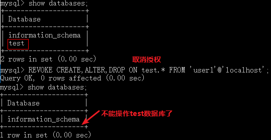
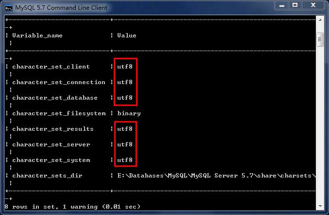
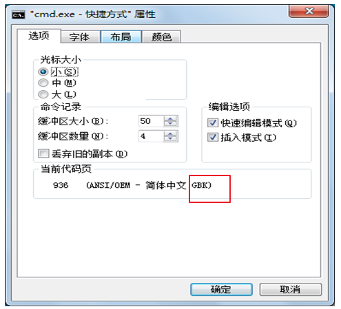

# 第一章 MySQL的常用函数

## 1.1 字符串函数

### 1.1.1 字符串函数列表概览

| 函数                                  | 用法                                                         |
| ------------------------------------- | ------------------------------------------------------------ |
| CONCAT(S1,S2,......,Sn)               | 连接S1,S2,......,Sn为一个字符串                              |
| CONCAT_WS(separator, S1,S2,......,Sn) | 连接S1一直到Sn，并且中间以separator作为分隔符                |
| CHAR_LENGTH(s)                        | 返回字符串s的字符数                                          |
| LENGTH(s)                             | 返回字符串s的字节数，和字符集有关                            |
| INSERT(str, index , len, instr)       | 将字符串str从第index位置开始，len个字符长的子串替换为字符串instr |
| UPPER(s) 或 UCASE(s)                  | 将字符串s的所有字母转成大写字母                              |
| LOWER(s)  或LCASE(s)                  | 将字符串s的所有字母转成小写字母                              |
| LEFT(s,n)                             | 返回字符串s最左边的n个字符                                   |
| RIGHT(s,n)                            | 返回字符串s最右边的n个字符                                   |
| LPAD(str, len, pad)                   | 用字符串pad对str最左边进行填充，直到str的长度为len个字符     |
| RPAD(str ,len, pad)                   | 用字符串pad对str最右边进行填充，直到str的长度为len个字符     |
| LTRIM(s)                              | 去掉字符串s左侧的空格                                        |
| RTRIM(s)                              | 去掉字符串s右侧的空格                                        |
| TRIM(s)                               | 去掉字符串s开始与结尾的空格                                  |
| TRIM(【BOTH 】s1 FROM s)              | 去掉字符串s开始与结尾的s1                                    |
| TRIM(【LEADING】s1 FROM s)            | 去掉字符串s开始处的s1                                        |
| TRIM(【TRAILING】s1 FROM s)           | 去掉字符串s结尾处的s1                                        |
| REPEAT(str, n)                        | 返回str重复n次的结果                                         |
| REPLACE（str, a, b）                  | 用字符串b替换字符串str中所有出现的字符串a                    |
| STRCMP(s1,s2)                         | 比较字符串s1,s2                                              |
| SUBSTRING(s,index,len)                | 返回从字符串s的index位置其len个字符                          |

### 1.1.2 环境准备

```mysql
-- 用户表
CREATE TABLE t_user (
  id int(11) NOT NULL AUTO_INCREMENT,
  uname varchar(40) DEFAULT NULL,
  age int(11) DEFAULT NULL,
  sex int(11) DEFAULT NULL,
  PRIMARY KEY (id)
);

insert  into t_user values (null,'zs',18,1);
insert  into t_user values (null,'ls',20,0);
insert  into t_user values (null,'ww',23,1);
insert  into t_user values (null,'zl',24,1);
insert  into t_user values (null,'lq',15,0);
insert  into t_user values (null,'hh',12,0);
insert  into t_user values (null,'wzx',60,null);
insert  into t_user values (null,'lb',null,null);
```

### 1.1.3 字符串连接函数

字符串连接函数主要有2个：

| 函数或操作符                          | 描述                                     |
| ------------------------------------- | ---------------------------------------- |
| concat(str1, str2, ...)               | 字符串连接函数，可以将多个字符串进行连接 |
| concat_ws(separator, str1, str2, ...) | 可以指定间隔符将多个字符串进行连接；     |

练习1：使用concat函数显示出 你好,uname 的结果

```mysql
SELECT CONCAT('你好,' , uname) FROM t_user;
```

练习2：使用concat_ws函数显示出 你好,uname 的结果

```mysql
SELECT CONCAT_WS(',', '你好', uname) FROM t_user;
```

### 1.1.4 字符串大小写处理函数

字符串大小写处理函数主要有2个：

| 函数或操作符 | 描述              |
| ------------ | ----------------- |
| upper(str)   | 得到str的大写形式 |
| lower(str)   | 得到str的小写形式 |

练习1： 将字符串 hello 转换为大写显示

```mysql
SELECT UPPER('hello'); -- HELLO
```

练习2：将字符串 heLLo 转换为小写显示

```mysql
SELECT LOWER('heLLo'); -- hello
```


### 1.1.5 移除空格函数

可以对字符串进行按长度填充满、也可以移除空格符

| 函数或操作符 | 描述                  |
| ------------ | --------------------- |
| trim(str)    | 将str两边的空白符移除 |

练习1： 将用户id位8的用户的姓名的两边空白符移除

```mysql
-- 表中数据是：'      lb   ', 使用trim后是： 'lb'
SELECT TRIM(uname) FROM t_user  WHERE id = 8; 
```


### 1.1.6 子串函数

字符串也可以按条件进行截取，主要有以下可以截取子串的函数;

| 函数或操作符          | 描述                                                         |
| --------------------- | ------------------------------------------------------------ |
| substr()、substring() | 获取子串： 1：substr(str, pos) 、substring(str, pos)； 2：substr(str, pos, len)、substring(str, pos, len) |

练习1：获取 hello,world 从第二个字符开始的完整子串

```mysql
SELECT SUBSTRING("hello,world",2)
```

练习2：获取 hello,world 从第二个字符开始但是长度为4的子串

```mysql
SELECT SUBSTR("hello,world", 2, 4); -- ello
```

## 1.2 数值函数

### 1.2.1 数值函数列表

| 函数          | 用法                                 |
| ------------- | ------------------------------------ |
| ABS(x)        | 返回x的绝对值                        |
| CEIL(x)       | 返回大于x的最小整数值                |
| FLOOR(x)      | 返回小于x的最大整数值                |
| MOD(x,y)      | 返回x/y的模                          |
| RAND()        | 返回0~1的随机值                      |
| ROUND(x,y)    | 返回参数x的四舍五入的有y位的小数的值 |
| TRUNCATE(x,y) | 返回数字x截断为y位小数的结果         |
| SQRT(x)       | 返回x的平方根                        |
| POW(x,y)      | 返回x的y次方                         |

### 1.2.2 常用数值函数练习

练习1： 获取 -12 的绝对值

```mysql
select abs(-12);
```

练习2： 将 -11.2 向上取整

```mysql
select ceil(-11.2);
```

练习3： 将 1.6 向下取整

```mysql
select floor(1.6);
```

练习4： 获得2的32次幂的值

```mysql
select pow(2, 32);
```

练习5： 获得一个在0-100之间的随机数

```mysql
select rand()*100;
```

## 1.3 日期函数

### 1.3.1 日期函数列表

| 函数                                                         | 用法                                                         |
| ------------------------------------------------------------ | ------------------------------------------------------------ |
| **CURDATE()** 或 CURRENT_DATE()                              | 返回当前日期                                                 |
| **CURTIME()** 或 CURRENT_TIME()                              | 返回当前时间                                                 |
| **NOW()** / SYSDATE() / CURRENT_TIMESTAMP() / LOCALTIME() / LOCALTIMESTAMP() | 返回当前系统日期时间                                         |
| **YEAR(date) / MONTH(date) / DAY(date) / HOUR(time) / MINUTE(time) / SECOND(time)** | 返回具体的时间值                                             |
| WEEK(date) / WEEKOFYEAR(date)                                | 返回一年中的第几周                                           |
| DAYOFWEEK()                                                  | 返回今天是一周的第几天，注意：周日是1，周一是2，。。。周六是7 |
| WEEKDAY(date)                                                | 返回周几，注意，周1是0，周2是1，。。。周日是6                |
| DAYNAME(date)                                                | 返回星期：MONDAY,TUESDAY.....SUNDAY                          |
| MONTHNAME(date)                                              | 返回月份：January，。。。。。                                |
| DATEDIFF(date1,date2) / TIMEDIFF(time1, time2)               | 返回date1 - date2的日期间隔 / 返回time1 - time2的时间间隔    |
| DATE_ADD(datetime, INTERVAL  expr type)                      | 返回与给定日期时间相差INTERVAL时间段的日期时间               |
| DATE_FORMAT(datetime ,fmt)                                   | 按照字符串fmt格式化日期datetime值                            |
| STR_TO_DATE(str, fmt)                                        | 按照字符串fmt对str进行解析，解析为一个日期                   |

其中：

**（1）DATE_ADD(datetime,INTERVAL  expr type)**

表达式类型：

| 参数类型 | 参数类型      |
| -------- | ------------- |
| YEAR     | YEAR_MONTH    |
| MONTH    | DAY_HOUR      |
| DAY      | DAY_MINUTE    |
| HOUR     | DAY_SECOND    |
| MINUTE   | HOUR_MINUTE   |
| SECOND   | HOUR_SECOND   |
|          | MINUTE_SECOND |

举例：

```sql
-- 返回一年后的今天
SELECT DATE_ADD(NOW(), INTERVAL 1 YEAR);
SELECT DATE_ADD(NOW(), INTERVAL -1 YEAR);   #可以是负数
SELECT DATE_ADD(NOW(), INTERVAL '1_1' YEAR_MONTH);   #需要单引号
```

**（2）DATE_FORMAT(datetime,fmt) 和 STR_TO_DATE(str, fmt)**

| 格式符 | 说明                                                        | 格式符 | 说明                                                        |
| ------ | ----------------------------------------------------------- | ------ | ----------------------------------------------------------- |
| %Y     | 4位数字表示年份                                             | %y     | 表示两位数字表示年份                                        |
| %M     | 月名表示月份（January,....）                                | %m     | 两位数字表示月份（01,02,03。。。）                          |
| %b     | 缩写的月名（Jan.，Feb.，....）                              | %c     | 数字表示月份（1,2,3,...）                                   |
| %D     | 英文后缀表示月中的天数（1st,2nd,3rd,...）                   | %d     | 两位数字表示月中的天数(01,02...)                            |
| %e     | 数字形式表示月中的天数（1,2,3,4,5.....）                    |        |                                                             |
| %H     | 两位数字表示小数，24小时制（01,02..）                       | %h和%I | 两位数字表示小时，12小时制（01,02..）                       |
| %k     | 数字形式的小时，24小时制(1,2,3)                             | %l     | 数字形式表示小时，12小时制（1,2,3,4....）                   |
| %i     | 两位数字表示分钟（00,01,02）                                | %S和%s | 两位数字表示秒(00,01,02...)                                 |
| %W     | 一周中的星期名称（Sunday...）                               | %a     | 一周中的星期缩写（Sun.，Mon.,Tues.，..）                    |
| %w     | 以数字表示周中的天数(0=Sunday,1=Monday....)                 |        |                                                             |
| %j     | 以3位数字表示年中的天数(001,002...)                         | %U     | 以数字表示年中的第几周，（1,2,3。。）其中Sunday为周中第一天 |
| %u     | 以数字表示年中的第几周，（1,2,3。。）其中Monday为周中第一天 |        |                                                             |
| %T     | 24小时制                                                    | %r     | 12小时制                                                    |
| %p     | AM或PM                                                      | %%     | 表示%                                                       |

### 1.3.2 常用日期函数的练习

练习1：获取当前的日期

```mysql
SELECT CURDATE();
```

练习2： 获取当前的时间（仅仅需要时分秒）

```mysql
SELECT CURTIME();
```

练习3： 获取当前日期时间（包含年月日时分秒）

```mysql
select now();
```

练习4: 获取到五一还有多少天

```mysql
select DATEDIFF('2021-05-01',CURDATE())
```

## 1.4 流程函数

| 函数                                                         | 用法                                         |
| ------------------------------------------------------------ | -------------------------------------------- |
| IF(value,t ,f)                                               | 如果value是真，返回t，否则返回f              |
| IFNULL(value1, value2)                                       | 如果value1不为空，返回value1，否则返回value2 |
| CASE WHEN 条件1 THEN result1 WHEN 条件2 THEN result2 .... [ELSE resultn] END | 相当于Java的if...else if...else...           |
| CASE  expr WHEN 常量值1 THEN 值1 WHEN 常量值1 THEN 值1 .... [ELSE 值n] END | 相当于Java的switch...case...                 |

* 练习1：获取用户的姓名、性别，如果性别为1则显示1，否则显示0；要求使用if函数查询：

  ```mysql
  SELECT uname,IF(sex=1,1,0) FROM t_user
  ```


* 练习2：获取用户的姓名、性别，如果性别为null则显示为1；要求使用ifnull函数查询：

  ```mysql
  SELECT uname, IFNULL(sex, 1) FROM t_user;
  ```


* 举例3：

  ```mysql
  SELECT id,uname,age,CASE WHEN IFNULL(age,0) <= 12 THEN '儿童'
  WHEN age <= 18 THEN '少年'
  WHEN age <= 40 THEN '中年'
  ELSE '老年' END '描述' FROM t_user
  ```
  
## 1.5 其他函数
  
| 函数          | 用法                                    |
  | ------------- | --------------------------------------- |
  | database()    | 返回当前数据库名                        |
  | version()     | 返回当前数据库版本                      |
  | user()        | 返回当前登录用户名                      |
  | password(str) | 返回字符串str的加密版本，41位长的字符串 |
  | md5(str)      | 返回字符串str的md5值，也是一种加密方式  |


# 第二章 事务(TCL)

## 2.1 事务的概述

### 2.1.1 概念

保证事务中的所有操作都作为一个工作单元来执行，即使出现了故障，都不能改变这种执行方式。当在一个事务中执行多个操作时，要么所有的事务都被提交(commit)，那么这些修改就永久地保存下来；要么数据库管理系统将放弃所作的所有修改，整个事务回滚(rollback)到最初状态。

### 2.1.2 事务的原理

事务开启之后, 所有的操作都会临时保存到事务日志, 事务日志只有在得到`commit`命令才会同步到数据表中，其他任何情况都会清空事务日志(rollback，断开连接)


### 2.1.3 事务的使用场景

如果在某个业务中需要执行多条SQL语句，那么此时一般是需要使用到事务，从而保证这多条SQL语句执行同时成功或同时失败。例如: 转账、批量删除、从购物车中提交订单等等操作

### 2.1.4 事务的四大特性(ACID)

#### 1. 原子性（Atomicity）

原子性是指事务是一个不可分割的工作单位，事务中的操作要么都发生，要么都不发生。 

#### 2. 一致性（Consistency）

事务必须使数据库从一个一致性状态变换到另外一个一致性状态。

#### 3. 隔离性（Isolation）

事务的隔离性是指一个事务的执行不能被其他事务干扰，即一个事务内部的操作及使用的数据对并发的其他事务是隔离的，并发执行的各个事务之间不能互相干扰。

#### 4. 持久性（Durability）

持久性是指一个事务一旦被提交，它对数据库中数据的改变就是永久性的，接下来的其他操作和数据库故障不应该对其有任何影响

## 2.2 MYSQL进行事务管理操作

### 2.2.1 自动事务(mysql默认)

MySQL默认是自动提交事务的，一条sql语句就是一个事务

### 2.2.2 手动开启一个事务

#### 2.2.2.1 方式一: 手动开启事务的方式

```
start transaction;
```

手动开启事务之后，执行的SQL语句都不会真正改变数据库中的数据，需要用户手动提交事务才能够真正执行SQL语句

#### 2.2.2.2 方式二:  设置MYSQL中的自动提交的参数【了解】

**第一步: 查看MYSQL中事务是否自动提交**

```mysql
show variables like '%commit%';
```

**第二步: 设置自动提交的参数为OFF**

```mysql
# 0:OFF  1:ON
set autocommit = 0;
```

#### 2.2.2.3 提交和回滚事务

##### 1. 提交事务

当这个事务中的SQL语句执行完毕之后，没有出现任何问题，那么我们需要在最后提交事务，让这些SQL语句真正执行去改变数据库中的数据

```
commit;
```

##### 2. 回滚事务

当执行这个事务中的SQL语句的过程中，一旦出现问题或者异常，则需要回滚事务，从而回到SQL语句执行之前的状态

```
rollback;
```

## 2.3 事务的隔离级别

### 2.3.1 不考虑事务的隔离性会引发的问题

事务在操作时的理想状态： 所有的事务之间保持隔离，互不影响。因为并发操作，多个用户同时访问同一个数据。可能引发并发访问的问题


### 2.3.1 事务隔离级别

​	可以通过设置事物隔离级别解决读的问题

#### 2.3.1.1 事务四个隔离级别  

| **级别** | **名字** | **隔离级别**     | **脏读** | **不可重复读** | **幻读** | **数据库默认隔离级别** |
| -------- | -------- | ---------------- | -------- | -------------- | -------- | ---------------------- |
| **1**    | 读未提交 | read uncommitted | 是       | 是             | 是       |                        |
| **2**    | 读已提交 | read committed   | 否       | 是             | 是       | Oracle                 |
| **3**    | 可重复读 | repeatable read  | 否       | 否             | 是       | MySQL                  |
| **4**    | 串行化   | serializable     | 否       | 否             | 否       | 最高的隔离级别         |

> 隔离级别越高，性能(效率)越差，安全性越高。

##### 2.3.2设置隔离级别

- 设置事务隔离级别

```mysql
set session transaction isolation level  隔离级别;
eg: 设置事务隔离级别为read uncommitted
set session transaction isolation level read uncommitted;
```

- 查询当前事务隔离级别

```mysql
select @@tx_isolation;
```

## 2.4 演示数据库安全性问题

### 2.4.1 准备工作

```mysql
create table account(
    id int primary key auto_increment,
    name varchar(20),
    money double
);

insert into account values (null,'zs',1000);
insert into account values (null,'ls',1000);
insert into account values (null,'ww',1000);
```

### 2.4.2 演示脏读

​	一个事物里面读到了另外一个事物没有提交的数据: read uncommitted

- 1.开启A，B窗口

- 2.分别查询A，B的隔离级别

  ```
  select @@tx_isolation;
  ```

- 3.设置A窗口的隔离级别为read uncommitted(读未提交)

  ```
  set session transaction isolation level read uncommitted;
  ```

- 4.A，B都开始事物

- 5.在B中zs向ls转账100，事物不提交

- 6.在A中查询账户

### 2.4.3 演示不可重复读(解决脏读)

​	不可重复读: 在一个事物里面,同一条语句,两次查询的结果不一致.

- 1.开启A，B窗口

- 2.分别查询A,B的隔离级别

  ```
  select @@tx_isolation;
  ```

- 3.设置A窗口的隔离级别为Read committed(读已提交)

  ```
  set session transaction isolation level Read committed;
  ```

- 4.A，B都开始事物

- 5.在B中张三向李四转账100，事物不提交

- 6.在A中查询账户（避免脏读发生）

- 7.B中提交事物

- 8.在A中查询账户（两次查询的结果不一致，不可重复读发生）

### 2.4.4 演示避免不可重复读

- 1.开启A，B窗口

- 2.分别查询A,B的隔离级别

  ```
  select @@tx_isolation
  ```

- 3.设置A窗口的隔离级别为Repeatable read

  ```
  set session transaction isolation level Repeatable read;
  ```


- 4.A，B都开始事物
- 5.在B中张三向李四转账100，事物不提交
- 6.A中查询账户
- 7.B中提交
- 8.A中查询账户
- 9.A中结束事物，再重新查询

### 2.4.5 演示隔离级别Serializable

- 1.开启A，B窗口

- 2.分别查询A,B的隔离级别

  ```
  select @@tx_isolation
  ```

- 3.设置A窗口的隔离级别为Serializable

  ```
  set session transaction isolation level Serializable;
  ```


- 4.A，B都开始事物


- 5.B中向account账户插入一条数据，不提交
- 6.A中查询
- 7.在B中结束事物
- 8.A中查询

# 第三章 DCL语句

我们现在默认使用的都是root用户，超级管理员，拥有全部的权限。但是，一个公司里面的数据库服务器上面可能同时运行着很多个项目的数据库。所以，我们应该可以根据不同的项目建立不同的用户，分配不同的权限来管理和维护数据库。

## 3.1 创建用户

`CREATE USER '用户名'@'主机名' IDENTIFIED BY '密码';`
**关键字说明：**

1. `用户名`：将创建的用户名

         2. `主机名`：指定该用户在哪个主机上可以登陆，如果是本地用户可用localhost，如果想让该用户可以从任意远程主机登陆，可以使用通配符%

   3. `密码`：该用户的登陆密码，密码可以为空，如果为空则l该用户可以不需要密码登陆服务器

**具体操作：**

```sql
-- user1用户只能在localhost这个IP登录mysql服务器
CREATE USER 'user1'@'localhost' IDENTIFIED BY '123';
-- user2用户可以在任何电脑上登录mysql服务器
CREATE USER 'user2'@'%' IDENTIFIED BY '123';
```

## 3.2 授权用户

用户创建之后，基本没什么权限！需要给用户授权


**授权格式**：
`GRANT 权限1, 权限2... ON 数据库名.表名 TO '用户名'@'主机名';`
**关键字说明**：
      1. `GRANT` 授权关键字
      2. 授予用户的权限，如`SELECT`，`INSERT`，`UPDATE`等。如果要授予所的权限则使用`ALL`
      3. `数据库名.表名`：该用户可以操作哪个数据库的哪些表。如果要授予该用户对所有数据库和表的相应操作权限则可用*表示，如`*.*`
      4. `'用户名'@'主机名'`: 给哪个用户授权


**具体操作：**

1. 给user1用户分配对test这个数据库操作的权限

   ```sql
   GRANT CREATE,ALTER,DROP,INSERT,UPDATE,DELETE,SELECT ON test.* TO 'user1'@'localhost';
   ```

   

2. 给user2用户分配对所有数据库操作的权限

   ```sql
   GRANT ALL ON *.* TO 'user2'@'%';
   ```

   

## 3.3 撤销授权

`REVOKE  权限1, 权限2... ON 数据库.表名 FROM '用户名'@'主机名';`

**具体操作：**

* 撤销user1用户对test操作的权限

  ```sql
  REVOKE ALL ON test.* FROM 'user1'@'localhost';
  ```

  

## 3.4 查看权限

`SHOW GRANTS FOR '用户名'@'主机名';`
**具体操作：**

* 查看user1用户的权限

  ```sql
  SHOW GRANTS FOR 'user1'@'localhost';
  ```

  

## 4.5 删除用户

`DROP USER '用户名'@'主机名';`
**具体操作：**

* 删除user2

  ```sql
   DROP USER 'user2'@'%';
  ```

  

## 4.6 修改用户密码

### 4.6.1 修改管理员密码

`mysqladmin -uroot -p password 新密码  -- 新密码不需要加上引号`

>注意：需要在未登陆MySQL的情况下操作。

**具体操作：**

   ```sql
mysqladmin -uroot -p password root
输入老密码
   ```

   

### 4.6.2 修改普通用户密码

`set password for '用户名'@'主机名' = password('新密码');`

>注意：需要在登陆MySQL的情况下操作。

**具体操作：**

   ```sql
`set password for 'user1'@'localhost' = password('666666');`
   ```

   

# 第四章 经典问题

## 1. 编码问题(了解)

### 命令行操作sql乱码问题

```mysql
mysql> INSERT INTO t_stu VALUES(1,'张三','男');
ERROR 1366 (HY000): Incorrect string value: '\xD5\xC5\xC8\xFD' for column 'sname' at row 1
```

### 修改my.ini配置文件

```ini
在路径：mysql的数据存储路径下 找到my.ini文件
修改内容1：
	找到[mysql]命令，大概在63行左右，在其下一行添加 
		default-character-set=utf8
修改内容2:
	找到[mysqld]命令，大概在76行左右，在其下一行添加
		character-set-server=utf8
		collation-server=utf8_general_ci

修改完毕后，重启MySQL57服务
```

查看编码命令

```sql
show variables like 'character_%';
show variables like 'collation_%';
```




* 如果是以上配置就说明对了

### 命令行操作sql仍然乱码问题

```mysql
mysql> INSERT INTO t_stu VALUES(1,'张三','男');
ERROR 1366 (HY000): Incorrect string value: '\xD5\xC5\xC8\xFD' for column 'sname' at row 1
```

原因：按照刚才的配置，服务器端认为你的客户端的字符集是utf-8，而实际上你的客户端的字符集是GBK。



查看所有字符集：**SHOW VARIABLES LIKE 'character_set_%';**


解决方案，设置当前连接的客户端字符集 **“SET NAMES GBK;”**

set names gbk;是为了告诉服务器,客户端用的GBK编码,防止乱码。


有的时候，这样还不能解决，例如，某些win10操作系统环境下，那么修改命令行的属性-》选项-》勾选使用旧版控制台，然后重启电脑


## 2. 忘记root用户密码问题

1. 关闭MYSQL57服务

```
# 以管理员权限运行cmd
net stop MYSQL57
```

2. 设置mysqld服务不检查权限密码

mysql5.5

```cmd
mysqld --skip-grant-tables
```

mysql5.7版

```
# 修改my.ini文件
# 在[mysqld]下方添加
skip-grant-tables = true
```

3. 开启MYSQL57服务

```
# 以管理员权限运行cmd
net start MYSQL57
```

4. `mysql -uroot`  无密码登陆服务器

5. 修改root账户的密码为"root"

mysql5.5版

```
update user set authentication_string=password("root") where user="root";
```

mysql5.7版

```
update mysql.user set authentication_string=password('root') where user='root';
```

6.  刷新: `flush privileges;`
7. 退出登录的mysql

```
exit;
```

8. 修改my.ini文件，删除掉之前添加在[mysqld]下方的那一行
9. 验证无密码登录是否会失败`mysql -uroot`

10. 以新密码登录: `mysql -uroot -proot`


## 3. 查看字符集和校对规则

关于SQL的关键字和函数名等不区分大小写，但是对于数据值是否区分大小写，和字符集与校对规则有关。

_ci（大小写不敏感），_cs（大小写敏感），_bin（二元，即比较是基于字符编码的值而与language无关）

（1）查看所有字符集和和其默认的校对规则

 

（2）查看GBK和UTF-8字符集的校对规则

show collation like 'gbk%';

 

show collation like 'utf8%';

 

utf8_unicode_ci和utf8_general_ci对中、英文来说没有实质的差别。
utf8_general_ci 校对速度快，但准确度稍差。
utf8_unicode_ci 准确度高，但校对速度稍慢。

如果你的应用有德语、法语或者俄语，请一定使用utf8_unicode_ci。一般用utf8_general_ci就够了。

（3）查看服务器的字符集和校对规则

 

（4）查看和修改某个数据库的字符集和校对规则

 

或

 

修改数据库的字符集和校对规则：

ALTER DATABASE 数据库名称 DEFAULT CHARACTER SET 字符集名称 【COLLATE 校对规则名称】;

例如：

ALTER DATABASE ceshi_db DEFAULT CHARACTER SET utf8 collate utf8_general_ci;

 

注意：修改了数据库的默认字符集和校对规则后，原来已经创建的表格的字符集和校对规则并不会改变，如果需要，那么需要单独修改。

（5）查看某个表格的字符集和校对规则

查看字符集：show create table users;

 

如果要查看校对规则：show table status from bookstore like '%users%' ;

 

修改某个表格的字符集和校对规则：

修改表的默认字符集：

ALTER TABLE 表名称 DEFAULT CHARACTER SET 字符集名称 【COLLATE 校对规则名称】;

把表默认的字符集和所有字符列（CHAR,VARCHAR,TEXT）改为新的字符集：

ALTER TABLE 表名称 CONVERT TO CHARACTER SET 字符集名称 【COLLATE 校对规则名称】;

 

例如：ALTER TABLE ceshi_table DEFAULT CHARACTER SET gbk collate gbk_chinese_ci;
