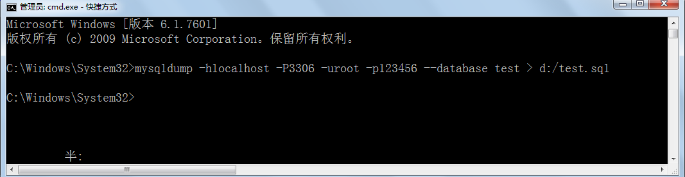

# 第一章 数据库概述

## 1.1 数据库概述

DBMS：数据库管理系统（Database Management System）是一种操纵和管理数据库的大型软件，例如建立、使用和维护数据库。

DB：数据库（Database）

SQL：结构化查询语言，（Structure Query Language），专门用来操作/访问数据库的通用语言。

MySQL：其中的一款关系型数据库管理系统

以下是2019年**DB-Engines Ranking** 对各数据库受欢迎程度进行调查后的统计结果：（查看数据库最新排名:https://db-engines.com/en/ranking）


关系型数据库，采用关系模型来组织数据，简单来说，**关系模型指的就是二维表格模型**。类似于Excel工作表。**非关系型数据库**，可看成传统关系型数据库的功能阉割版本，基于键值对存储数据，通过减少很少用的功能，来提高性能。

### 关系型数据库设计规则

* **遵循ER模型**

  * E    entity   代表实体的意思      对应到数据库当中的一张表          
  * R    relationship 代表关系的意思  

* **具体体现**

  * 将数据放到表中，表再放到库中。
  * 一个数据库中可以有多个表，每个表都有一个名字，用来标识自己。表名具有唯一性。
  * 表具有一些特性，这些特性定义了数据在表中如何存储，类似java和python中 “类”的设计。
  * 表由列组成，我们也称为**字段**。每个字段描述了它所含有的数据的意义，**数据表的设计实际上就是对字段的设计**。创建数据表时，为每个字段分配一个数据类型，定义它们的数据长度和字段名。每个字段类似java 或者python中的“实例属性”。
  * 表中的数据是按行存储的，一行即为一条记录。每一行类似于java或python中的“对象”。

  

## 1.2  MySQL概述

MySQL**是一种开放源代码的关系型数据库管理系统，开发者为瑞典MySQL AB公司。在2008年1月16号被Sun公司收购。而2009年,SUN又被Oracle收购。目前 MySQL被广泛地应用在Internet上的中小型网站中。由于其**体积小、速度快、总体拥有成本低，尤其是开放源码这一特点，使得很多互联网公司选择了MySQL作为网站数据库（Facebook, Twitter, YouTube，阿里的蚂蚁金服，去哪儿，魅族，百度外卖，腾讯）。


## 1.3 Mysql软件的卸载、安装和配置

见《MySQL5.7安装文档.md》

# 第二章 MySQL的使用

## 2.1 MySQL服务的启动

“我的电脑/计算机”-->右键-->“管理”-->“服务”-->启动和关闭MySQL服务

“开始菜单”-->“控制面板”-->“管理工具”-->“服务”-->启动和关闭MySQL

“任务管理器”-->“服务”-->启动和关闭MySQL

    

或者

以管理员身份打开命令行

```cmd
net  start  MySQL服务名
net  stop  MySQL服务名
```

## 2.2 客户端连接MySQL

1、命令行客户端：

```cmd
mysql -h 主机IP地址 -P 端口号	-u 用户名	-p回车
Enter Password:密码
```

> 如果访问本机，-h localhost可以省略
>
> 如果端口号没有修改，-P 3306可以省略
>
> 除了-p与密码之间不要空格外，其他的-h,-P,-u与后面的参数值之间可以有空格
>
> 想要连接成功，必须保证服务开启的
>

2、其他客户端，例如：可视化工具Navicat或SQLyog等


# 第三章 SQL的介绍

## 2.1.什么是sql

- SQL：Structure Query Language。（结构化查询语言）,通过sql操作数据库(操作数据库,操作表,操作数据)
- SQL被美国国家标准局（ANSI）确定为关系型数据库语言的美国标准，后来被国际化标准组织（ISO）采纳为关系数据库语言的国际标准   
- 各数据库厂商(MySql,oracle,sql server)都支持ISO的SQL标准。
- 各数据库厂商在标准的基础上做了自己的扩展。   各个数据库自己特定的语法 

## 2.2 sql的分类

- Data Definition Language (DDL数据定义语言) 如：操作数据库，操作表
- **Data  Manipulation Language**(DML数据操纵语言)，如：对表中的记录操作增删改
- **Data Query Language**(DQL 数据查询语言)，如：对表中数据的查询操作
- Data Control Language(DCL 数据控制语言)，如：对用户权限的设置

## 2.3 MySQL的语法规范和要求

（1）mysql的sql语法不区分大小写  

> MySQL的关键字和函数名等不区分大小写，但是对于数据值是否区分大小写，和字符集与校对规则有关。

ci（大小写不敏感），cs（大小写敏感），_bin（二元，即比较是基于字符编码的值而与language无关，区分大小写）

（2）命名时：尽量使用26个英文字母大小写，数字0-9，下划线，不要使用其他符号

（3）建议不要使用mysql的关键字等来作为表名、字段名等，如果不小心使用，请在SQL语句中使用`（飘号）引起来 	

（4）数据库和表名、字段名等对象名中间不要包含空格

（5）同一个mysql软件中，数据库不能同名，同一个库中，表不能重名，同一个表中，字段不能重名

（6）标点符号：

> 必须成对
>
> 必须英文状态下半角输入方式
>
> 字符串和日期类型可以使用单引号''
>
> 列的别名可以使用双引号""，给表名取别名不要使用双引号。取别名时as可以省略
>
> 如果列的别名没有包含空格，可以省略双引号，如果有空格双引号不能省略。

（7）SQL脚本中如何加注释

> 单行注释：#注释内容
>
> 单行注释：--空格注释内容    其中--后面的空格必须有
>
> 多行注释：/* 注释内容 */

```mysql
#以下两句是一样的，不区分大小写
show databases;
SHOW DATABASES;

#创建表格
#create table student info(...); #表名错误，因为表名有空格
create table student_info(...); 

#其中name使用``飘号，因为name和系统关键字或系统函数名等预定义标识符重名了。
CREATE TABLE t_stu(
    id INT,
    `name` VARCHAR(20)
);

select id as "编号", `name` as "姓名" from t_stu; #起别名时，as都可以省略
select id as 编号, `name` as 姓名 from t_stu; #如果字段别名中没有空格，那么可以省略""
select id as 编 号, `name` as 姓 名 from t_stu; #错误，如果字段别名中有空格，那么不能省略""
```


# 第四章-DDL操作数据库

## 4.1创建数据库(掌握)

+ 语法

```sql
create database 数据库名 [character set 字符集][collate  校对规则]     注: []意思是可选的意思
```

字符集(charset)：是一套符号和编码。

+ 练习

创建一个day01的数据库（默认字符集)  

```sql
create database day01;
```

创建一个day01_2的数据库,指定字符集为gbk(了解) 

```sql
create database day01_2 character set gbk;
```

## 4.2查看所有的数据库

### 4.2.1查看所有的数据库

- 语法  

```sql
show databases; 
```

### 4.2.2查看数据库的定义结构【了解】

- 语法

```sql
show create database 数据库名;
```

- 查看day01这个数据库的定义

```sql
show create database day01; 
```

## 4.3删除数据库

- 语法 

```sql
drop database 数据库名;
```

- 删除day01_2数据库

```sql
drop database day01_2;
```

## 4.4修改数据库【了解】

- 语法 

```sql
alter database 数据库名 character set 字符集;
```

- 修改day01这个数据库的字符集(gbk)

```sql
alter database day01 character set gbk;
```

**注意：**

- 是utf8，不是utf-8
- 不是修改数据库名

## 4.5其他操作

- 切换数据库, 选定哪一个数据库

```sql
use 数据库名;   		//注意: 在创建表之前一定要指定数据库. use 数据库名
```

- 练习: 使用day01 

```sql
use day01;
```

- 查看正在使用的数据库

```sql
select database();
```

# 第五章-DDL操作表

## 5.1 创建表

### 5.1.1 语法

```sql
create table 表名(
	列名 类型 [约束],
	列名 类型 [约束]
	...
		
);
```

### 5.1.2 类型 

#### 5.1.2.1 数值类型

- 整型系列：xxxInt

> int(M)，必须和unsigned zerofill一起使用才有意义


- 浮点型系列：float,double（或real)

> double(M,D)：表示最长为M位，其中小数点后D位
>
> 例如：double(5,2)表示的数据范围[-999.99,999.99]，如果超过这个范围会报错。

- 定点型系列：decimal（底层实际上是使用字符串进行存储）


> decimal(M,D)：表示最长为M位，其中小数点后D位

- 位类型：bit

字节范围是：1-8，值范围是：bit(1)~bit(64)，默认bit(1)

用来存储二进制数。对于位字段，直接使用select命令将不会看到结果。可以使用bit()或hex()函数进行读取。插入bit类型字段时，使用bit()函数转为二进制值再插入，因为二进制码是“01”。

#### 5.1.2.2 日期时间类型

日期时间类型：year, date, datetime, timestamp

> 注意一下每一种日期时间的表示范围


timestamp和datetime的区别：

- timestamp范围比较小
- timestamp和时区有关
  - show variables like 'time_zone';
  - set time_zone = '+8:00';
- timestamp受MySQL版本和服务器的SQLMode影响很大
- 表中的第一个非空的timestamp字段如果插入和更新为NULL则会自动设置为系统时间


#### 5.1.2.3 字符串类型

MySQL中提供了多种对字符数据的存储类型，不同的版本可能有所差异。常见的有：

char,varchar，xxtext，binary，varbinary，xxblob，enum，set等等


- 字符串类型char,varchar(M)

> char如果没有指定宽度，默认为1个字符
>
> varchar(M)，必须指定宽度

- binary和varbinary类似于char和varchar，不同的是它们包含二进制字符串，不支持模糊查询之类的。

- 一般在保存少量字符串的时候，我们会选择char和varchar；而在保存较大文本时，通常会选择使用text或blob系列。blob和text值会引起一些性能问题，特别是在执行了大量的删除操作时，会在数据表中留下很大的“空洞”，为了提高性能，建议定期时候用optimize table功能对这类表进行碎片整理。可以使用合成的(Synthetic)索引来提高大文本字段的查询性能，如果需要对大文本字段进行模糊查询，MySql提供了前缀索引。但是仍然要在不必要的时候避免检索大型的blob或text值。

- enum枚举类型，它的值范围需要在创建表时通过枚举方式显式指定，对于1~255个成员的枚举需要1个字节存储；对于255`65535个成员需要2个字节存储。例如：gender enum('男','女')。如果插入枚举值以外的值，会按第一个值处理。一次只能从枚举值中选择一个。
- set集合类型，可以包含0~64个成员。一次可以从集合中选择多个成员。如果选择了1-8个成员的集合，占1个字节，依次占2个，3个。。8个字节。例如：hoppy  set('吃饭','睡觉','玩游戏','旅游')，选择时'吃饭,睡觉'或'睡觉,玩游戏,旅游'

#### 5.1.2.4 示例

```mysql
+----------------+--------------+------+-----+---------+----------------+
| Field          | Type         | Null | Key | Default | Extra          |
+----------------+--------------+------+-----+---------+----------------+
| eid            | int(11)      | NO   | PRI | NULL    | auto_increment |
| ename          | varchar(20)  | NO   |     | NULL    |                |
| tel            | char(11)     | NO   |     | NULL    |                |
| gender         | char(1)      | YES  |     | 男        |                |
| salary         | double       | YES  |     | NULL    |                |
| commission_pct | double(3,2)  | YES  |     | NULL    |                |
| birthday       | date         | YES  |     | NULL    |                |
| hiredate       | date         | YES  |     | NULL    |                |
| job_id         | int(11)      | YES  |     | NULL    |                |
| email          | varchar(32)  | YES  |     | NULL    |                |
| mid            | int(11)      | YES  |     | NULL    |                |
| address        | varchar(150) | YES  |     | NULL    |                |
| native_place   | varchar(10)  | YES  |     | NULL    |                |
| did            | int(11)      | YES  |     | NULL    |                |
+----------------+--------------+------+-----+---------+----------------+
```

### 5.1.3 约束  

- 即规则,规矩 限制; 
- 作用：保证用户插入的数据保存到数据库中是符合规范的

| 约束 | 约束关键字  |                                      |
| ---- | ----------- | ------------------------------------ |
| 主键 | primary key | 非空且唯一，并且一张表只能有一个主键 |
| 唯一 | unique      | 唯一，当前列不能出现相同的数据       |
| 非空 | not null    | 非空，当前列不能为null               |
| 默认 | default     | 如果当前列没有数据，则指定默认数据   |

**约束种类:** 

- not null: 非空 ;  eg:  username varchar(40)  not null  username这个列不能有null值
- unique:唯一约束, 后面的数据不能和前面重复;  eg: cardNo char(18) unique;  cardNo 列里面不可以有重复数据


- primary key；主键约束(非空+唯一);    一般用在表的id列上面.  一张表基本上都有id列的, id列作为唯一标识的 

  - auto_increment: **自动增长,必须是设置了primary key之后,才可以使用auto_increment** 
- id int  primary key   auto_increment;  id不需要我们自己维护了, 插入数据的时候直接插入null, 自动的增长进行填充进去, 避免重复了.  

注意:

1. 先设置了primary key 再能设置auto_increment
2. 只有当设置了auto_increment 才可以插入null , 否则插入null会报错

id列:

1. 给id设置为int类型, 添加主键约束,  自动增长
2. 或者给id设置为字符串类型,添加主键约束,  不能设置自动增长

### 5.1.4练习

- 创建一张学生表(含有id字段,姓名字段不能重复,性别字段不能为空默认值为男. id为主键自动增长) 

```sql
CREATE TABLE student(
	id INT PRIMARY KEY AUTO_INCREMENT, -- 主键自增长
	NAME VARCHAR(30) UNIQUE, -- 唯一约束
	gender CHAR(1) NOT NULL DEFAULT '男'
);
```

## 5.2 查看表【了解】

### 5.2.1查看所有的表

```sql
show tables;
```

### 5.2.2查看表的定义结构

+ 语法

  desc  表名；

+ 练习: 查看student表的定义结构

```sql
desc student;
```


## 5.3 修改表【掌握，但是不要记忆】

### 5.3.1语法

- 增加一列

```sql
alter table 【数据库名.]表名称 add 【column】 字段名 数据类型;
alter table 【数据库名.]表名称 add 【column】 字段名 数据类型 first;
alter table 【数据库名.]表名称 add 【column】 字段名 数据类型 after 另一个字段;
```

- 修改列的类型约束:` alter table 表名 modify 字段 类型 约束 ；`
- 修改列的名称，类型，约束: `alter table 表名 change 旧列 新列 类型 约束;`
- 删除一列: `alter table 表名 drop 列名;`
- 修改表名 : `rename table 旧表名 to 新表名;` 

### 5.3.2练习

- 给学生表增加一个grade字段,类型为varchar(20),不能为空

```sql
ALTER TABLE student ADD grade VARCHAR(20) NOT NULL;
```


- 给学生表的gender字段改成int类型，不能为空，默认值为1

```sql
alter table student modify gender varchar(20);
```

- 给学生表的grade字段修改成class字段

```sql
ALTER TABLE student CHANGE grade class VARCHAR(20) NOT NULL;
```


- 把class字段删除

```sql
ALTER TABLE student DROP class;
```

- 把学生表修改成老师表(了解)

```sql
RENAME TABLE student TO teacher;
```

## 5.4 删除表【掌握】

+ 语法

  drop table 表名；

+ 把teacher表删除

```sql
drop table teacher;
```

# 第六章-DML操作表记录-增删改【重点】 #

+ 准备工作: 创建一张商品表(商品id,商品名称,商品价格,商品数量.) 


```sql
create table product(
	pid int primary key auto_increment,
	pname varchar(40),
	price double,
	num int
);
```

## 6.1 插入记录

### 6.1.1 语法

+ 方式一:  插入指定列, **如果没有把这个列进行列出来, 以null进行自动赋值了**.

  eg: 只想插入pname, price ,  insert into t_product(pname, price) values('mac',18000);

```
insert into 表名(列,列..) values(值,值..);
```

> 注意:  如果没有插入了列设置了非空约束, 会报错的

+ 方式二: 插入所有的列,如果哪列不想插入值,则需要赋值为null


```sql
insert into 表名 values(值,值....);           

eg:
insert into product values(null,'苹果电脑',18000.0,10);
insert into product values(null,'华为5G手机',30000,20);
insert into product values(null,'小米手机',1800,30);
insert into product values(null,'iPhonex',8000,10);
insert into product values(null,'iPhone7',6000,200);
insert into product values(null,'iPhone6s',4000,1000);
insert into product values(null,'iPhone6',3500,100);
insert into product values(null,'iPhone5s',3000,100);

insert into product values(null,'方便面',4.5,1000);
insert into product values(null,'咖啡',11,200); 
insert into product values(null,'矿泉水',3,500);
```

## 6.2 更新记录

### 6.2.1语法

```mysql
update 表名 set 列 =值, 列 =值 [where 条件]
```

### 6.2.2练习

- 将所有商品的价格修改为5000元

```sql
update product set price = 5000;
```

- 将商品名是苹果电脑的价格修改为18000元

```sql
UPDATE product set price = 18000 WHERE pname = '苹果电脑';
```

- 将商品名是苹果电脑的价格修改为17000,数量修改为5

```sql
UPDATE product set price = 17000,num = 5 WHERE pname = '苹果电脑';
```

- 将商品名是方便面的商品的价格在原有基础上增加2元

```sql
UPDATE product set price = price+2 WHERE pname = '方便面';
```

## 6.3 删除记录

### 6.3.1delete

根据条件，一条一条数据进行删除

+ 语法

```
delete from 表名 [where 条件]    注意: 删除数据用delete,不用truncate
```

- 类型

删除表中名称为’苹果电脑’的记录

```
delete from product where pname = '苹果电脑';
```

删除价格小于5001的商品记录

```
delete from product where price < 5001;
```

删除表中的所有记录

```
delete from product;
```

### 6.3.2truncate

把表直接DROP掉，然后再创建一个同样的新表。删除的数据不能找回。执行速度比DELETE快

	truncate table 表;

### 6.3.3 工作中删除数据

+ 物理删除: 真正的删除了, 数据不在, 使用delete就属于物理删除
+ 逻辑删除: 没有真正的删除, 数据还在. 搞一个标记, 其实逻辑删除是更新  eg: state   1 启用   0禁用


# 第七章-DQL操作表记录-查询【重点】

## 7.1 基本查询语法

```sql
select 要查询的字段名 from 表名 [where 条件] 
```

## 7.2 简单查询

### 7.2.1 查询所有行和所有列的记录

+ 语法

```
select * form 表
```

+ 查询商品表里面的所有的列

```
select * from product;
```

### 7.2.2 查询某张表特定列的记录

+ 语法

```
select 列名,列名,列名... from 表
```

+ 查询商品名字和价格

```
select pname, price from product;
```

### 7.2.3 去重查询 distinct

+ 语法

```
SELECT DISTINCT 字段名 FROM 表名;   //要数据一模一样才能去重
```

+ 去重查询商品的名字

```mysql
SELECT DISTINCT pname,price FROM product
```

> 注意点: 去重针对某列, distinct前面不能先出现列名

### 7.2.4 别名查询

+ 语法

```
select 列名 as 别名 ,列名  from 表   //列别名  as可以不写
select 别名.* from 表 as 别名      //表别名(多表查询, 明天会具体讲)
```


- 查询商品信息，使用别名


```
SELECT pid ,pname AS '商品名',price AS '商品价格',num AS '商品库存' FROM product
```

### 7.2.5 运算查询(+,-,*,/,%等)

- 把商品名，和商品价格+10查询出来:我们既可以将某个字段加上一个固定值，又可以对多个字段进行运算查询


```mysql
select pname ,price+10 as price from product;

select name,chinese+math+english as total from student
```

>  注意

- 运算查询字段,字段之间是可以的  
- 字符串等类型可以做运算查询，但结果没有意义


## 7.3 条件查询(很重要)

### 7.3.1语法

```
select ... from 表 where 条件 
//取出表中的每条数据，满足条件的记录就返回，不满足条件的记录不返回
```

###  7.3.2 运算符

1、比较运算符

```mysql
大于：>
小于：<
大于等于：>=
小于等于：<=
等于：=   不能用于null判断
不等于：!=  或 <>
安全等于: <=>  可以用于null值判断
```

2、逻辑运算符（建议用单词，可读性来说）

```mysql
逻辑与：&& 或 and
逻辑或：|| 或 or
逻辑非：! 或 not
逻辑异或：^ 或 xor
```

3、范围

```mysql
区间范围：between x  and  y
	    not between x  and  y
集合范围：in (x,x,x) 
	    not  in (x,x,x)
```

4、模糊查询和正则匹配（只针对字符串类型，日期类型）

```
like 'xxx'  模糊查询是处理字符串的时候进行部分匹配
如果想要表示0~n个字符，用%
如果想要表示确定的1个字符，用_
```

```
regexp '正则'
```

5、特殊的null值处理

```
#（1）判断时
xx is null
xx is not null
xx <=> null
```

### 7.3.3 练习


- 查询商品价格>3000的商品


```
select * from product where price > 3000;
```


- 查询pid=1的商品


```
select * from product where pid = 1;
```


- 查询pid<>1的商品


```
select * from product where pid <> 1;
```


- 查询价格在3000到6000之间的商品


```
select * from product where price between 3000 and 6000;
```


- 查询pid在1，5，7，15范围内的商品


```
select * from product where id = 1;
select * from product where id = 5;
select * from product where id = 7;
select * from product where id = 15;

select * from product where id in (1,5,7,15);
```


- 查询商品名以iPho开头的商品(iPhone系列) 


```
select * from product where pname like 'iPho%';
```

- 查询商品价格大于3000并且数量大于20的商品   (条件 and 条件 and...)


```
select * from product where price > 3000 and num > 20;
```

- 查询id=1或者价格小于3000的商品 


```
select * from product where pid = 1 or price < 3000;
```

## 7.4 排序查询

排序是写在查询的后面，代表把数据查询出来之后再排序

### 7.4.1 环境的准备

```sql
# 创建学生表(有sid,学生姓名,学生性别,学生年龄,分数列,其中sid为主键自动增长)
CREATE TABLE student(
	sid INT PRIMARY KEY auto_increment,
	sname VARCHAR(40),
	sex VARCHAR(10),
	age INT,
    score DOUBLE
);

INSERT INTO student VALUES(null,'zs','男',18,98.5);
INSERT INTO student VALUES(null,'ls','女',18,96.5);
INSERT INTO student VALUES(null,'ww','男',15,50.5);
INSERT INTO student VALUES(null,'zl','女',20,98.5);
INSERT INTO student VALUES(null,'tq','男',18,60.5);
INSERT INTO student VALUES(null,'wb','男',38,98.5);
INSERT INTO student VALUES(null,'小丽','男',18,100);
INSERT INTO student VALUES(null,'小红','女',28,28);
INSERT INTO student VALUES(null,'小强','男',21,95);
```

### 7.4.2 单列排序

1. 语法:  只按某一个字段进行排序，单列排序

```
SELECT 字段名 FROM 表名 [WHERE 条件] ORDER BY 字段名 [ASC|DESC];  //ASC: 升序，默认值; DESC: 降序
```

2. 练习: 以分数降序查询所有的学生

```
SELECT * FROM student ORDER BY score DESC
```

### 7.4.3 组合排序

1. 语法: 同时对多个字段进行排序，如果第1个字段相等，则按第2个字段排序，依次类推

```
SELECT 字段名 FROM 表名 WHERE 字段=值 ORDER BY 字段名1 [ASC|DESC], 字段名2 [ASC|DESC];
```

2. 练习: 以分数降序查询所有的学生, 如果分数一致,再以age降序

```
SELECT * FROM student ORDER BY score DESC, age DESC
```


## 7.5 聚合函数 

聚合函数通常会和分组查询一起使用，用于统计每组的数据  

### 7.5.1 聚合函数列表  

| 聚合函数        | 作用                   |
| --------------- | ---------------------- |
| max(列名)       | 求这一列的最大值       |
| min(列名)       | 求这一列的最小值       |
| avg(列名)       | 求这一列的平均值       |
| **count(列名)** | 统计这一列有多少条记录 |
| sum(列名)       | 对这一列求总和         |

1. 语法

```sql
SELECT 聚合函数(列名) FROM 表名 [where 条件];
```

2. 练习

```sql
-- 求出学生表里面的最高分数
SELECT MAX(score) FROM student
-- 求出学生表里面的最低分数
SELECT MIN(score) FROM student
-- 求出学生表里面的分数的总和(忽略null值)
SELECT SUM(score) FROM student
-- 求出学生表里面的平均分
SELECT AVG(score) FROM student
-- 统计学生的总人数 (忽略null) 
SELECT COUNT(sid) FROM student
SELECT COUNT(*) FROM student
```

> 注意:  聚合函数会忽略空值NULL

我们发现对于NULL的记录不会统计，建议如果统计个数则不要使用有可能为null的列，但如果需要把NULL也统计进去呢？我们可以通过 IFNULL(列名，默认值) 函数来解决这个问题. 如果列不为空，返回这列的值。如果为NULL，则返回默认值。 

```mysql
SELECT AVG(IFNULL(score,0)) FROM student;
```


## 7.6 分组查询

GROUP BY将分组字段结果中相同内容作为一组，并且返回每组的第一条数据，所以单独分组没什么用处。分组的目的就是为了统计，一般分组会跟聚合函数一起使用

### 7.6.1分组

1. 语法

```sql
SELECT 字段1,字段2... FROM 表名  [where 条件] GROUP BY 列 [HAVING 条件];
```

2. 练习:根据性别分组, 统计每一组学生的总人数

```mysql
-- 根据性别分组, 统计每一组学生的总人数
SELECT sex '性别',COUNT(sid) '总人数' FROM student GROUP BY sex

-- 根据性别分组，统计每组学生的平均分
SELECT sex '性别',AVG(score) '平均分' FROM student GROUP BY sex

-- 根据性别分组，统计每组学生的总分
SELECT sex '性别',SUM(score) '总分' FROM student GROUP BY sex
```

### 7.6.2 分组后筛选 having

- 练习根据性别分组, 统计每一组学生的总人数> 5的(分组后筛选)

```sql
SELECT sex, count(*) FROM student GROUP BY sex HAVING count(*) > 5
```

* 练习根据性别分组，只统计年龄大于等于18的，并且要求组里的人数大于4

```mysql
SELECT sex '性别',COUNT(sid) '总人数' FROM student WHERE age >= 18 GROUP BY sex HAVING COUNT(sid) > 4
```

### 7.6.3 where和having的区别【面试】

| 子名       | 作用                                                         |
| ---------- | ------------------------------------------------------------ |
| where 子句 | 1) 对查询结果进行分组前，将不符合where条件的行去掉，即在分组之前过滤数据，即先过滤再分组。2) where后面不可以使用聚合函数 |
| having字句 | 1) having 子句的作用是筛选满足条件的组，即在分组之后过滤数据，即先分组再过滤。2) having后面可以使用聚合函数 |


## 7.7 分页查询  

### 7.7.1 语法

```sql
select ... from .... limit a ,b
```

| LIMIT a,b;                 |
| -------------------------- |
| a 表示的是跳过的数据条数   |
| b 表示的是要查询的数据条数 |

### 7.7.2 练习

```sql
-- 分页查询
-- limit 关键字是使用在查询的后边，如果有排序的话则使用在排序的后边
-- limit的语法: limit offset,length  其中offset表示跳过多少条数据，length表示查询多少条数据
SELECT * FROM product LIMIT 0,3
-- 查询product表中的前三条数据(0表示跳过0条，3表示查询3条)

SELECT * FROM product LIMIT 3,3
-- 查询product表的第四到六条数据(3表示跳过3条，3表示查询3条)
-- 分页的时候，只会告诉你我需要第几页的数据，并且每页有多少条数据
-- 假如，每页需要3条数据，我想要第一页数据: limit 0,3
-- 假如,每页需要3条数据，我想要第二页数据: limit 3,3
-- 假如，每页需要3条数据，我想要第三页数据: limit 6,3
-- 结论: length = 每页的数据条数，offset = (当前页数 - 1)*每页数据条数
-- limit (当前页数 - 1)*每页数据条数, 每页数据条数
```

## 7.8 查询的语法小结

```sql
select...from...where...group by...order by...limit

select...from...where...
select...from...where...order by...
select...from...where...limit...
select...from...where...order by...imit
```

# 第八章 导入和导出数据(了解)

## 8.1 单个数据库备份

mysql5.5

```sql
C:\Windows\System32> mysqldump -h主机地址 -P端口号 -u用户名 -p密码 --database  数据库名 > 文件路径/文件名.sql
```

例如：

```sql
C:\Windows\System32>mysqldump -hlocalhost -P3306 -uroot -p123456 --database  test > d:/test.sql
```



mysql5.7版

```cmd
C:\Windows\System32> mysqldump -h主机地址 -P端口号 -u用户名 -p密码  数据名 > 文件路径/文件名.sql
```

> 不要再写--database

## 8.2 导入执行备份的sql脚本

先登录mysql，然后执行如下命令：

```sql
mysql> source  sql脚本路径名.sql
```

例如：

```sql
mysql>source d:/test.sql;
```


