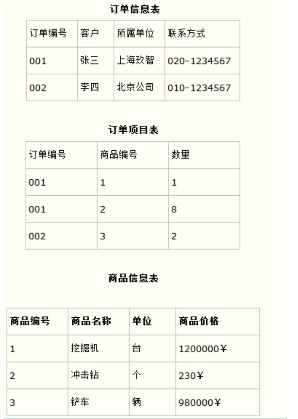
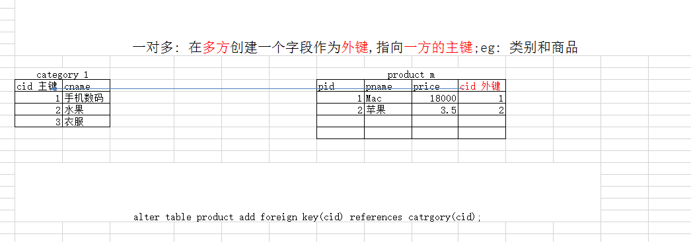

# 第一章 数据库三范式

好的数据库设计对数据的存储性能和后期的程序开发，都会产生重要的影响。建立科学的，规范的数据库就需要满足一些规则来优化数据的设计和存储，这些规则就称为范式。

## 1.1 第一范式: **确保每列保持原子性** 

第一范式是最基本的范式。如果数据库表中的所有字段值都是不可分解的原子值，就说明该数据库表满足了第一范式。

第一范式的合理遵循需要根据系统的实际需求来定。比如某些数据库系统中需要用到“地址”这个属性，本来直接将“地址”属性设计成一个数据库表的字段就行。但是如果系统经常会访问“地址”属性中的“城市”部分，那么就非要将“地址”这个属性重新拆分为省份、城市、详细地址等多个部分进行存储，这样在对地址中某一部分操作的时候将非常方便。这样设计才算满足了数据库的第一范式，如下表所示。


如果不遵守第一范式，查询出数据还需要进一步处理（查询不方便）。遵守第一范式，需要什么字段的数据就查询什么数据（方便查询）

## 1.2 第二范式: **确保表中的每列都和主键相关** 

第二范式在第一范式的基础之上更进一层。第二范式需要确保数据库表中的每一列都和主键相关，而不能只与主键的某一部分相关（主要针对联合主键而言）。也就是说在一个数据库表中，一个表中只能保存一种数据，不可以把多种数据保存在同一张数据库表中。

比如要设计一个订单信息表，因为订单中可能会有多种商品，所以要将订单编号和商品编号作为数据库表的联合主键，如下表所示


这样就产生一个问题：这个表中是以订单编号和商品编号作为联合主键。这样在该表中商品名称、单位、商品价格等信息不与该表的主键相关，而仅仅是与商品编号相关。所以在这里违反了第二范式的设计原则。

而如果把这个订单信息表进行拆分，把商品信息分离到另一个表中，把订单项目表也分离到另一个表中，就非常完美了。如下所示



这样设计，在很大程度上减小了数据库的冗余。如果要获取订单的商品信息，使用商品编号到商品信息表中查询即可 

## 1.3 第三范式: **确保每列都和主键列直接相关,而不是间接相关** 

第三范式需要确保数据表中的每一列数据都和主键直接相关，而不能间接相关。

比如在设计一个订单数据表的时候，可以将客户编号作为一个外键和订单表建立相应的关系。而不可以在订单表中添加关于客户其它信息（比如姓名、所属公司等）的字段。如下面这两个表所示的设计就是一个满足第三范式的数据库表。


 这样在查询订单信息的时候，就可以使用客户编号来引用客户信息表中的记录，也不必在订单信息表中多次输入客户信息的内容，减小了数据冗余 


# 第二章 外键约束

## 2.1 外键约束的概念

在遵循三范式的前提下，很多时候我们必须要进行拆表，将数据分别存放在多张表中，以减少冗余数据。但是拆分出来的表与表之间是有着关联关系的，我们必须得通过一种约束来约定表与表之间的关系，这种约束就是外键约束

## 2.2 外键约束的作用

外键约束是保证一个或两个表之间的参照完整性,外键是构建于一个表的两个字段或是两个表的两个字段之间的参照关系。

## 2.3 创建外键约束的语法

### 2.3.1 在建表时指定外键约束

```sql
create table [数据名.]从表名(
	字段名1 数据类型  primary key ,
	字段名2 数据类型 ,
	....,
    [constraint 外键约束名] foreign key (从表字段) references 主表名(主表字段) [on update 外键约束等级][on delete 外键约束等级]
    #外键只能在所有字段列表后面单独指定
    #如果要自己命名外键约束名，建议 主表名_从表名_关联字段名_fk
);
```

### 2.3.2 在建表后指定外键约束

```sql
alter table 从表名称 add [constraint 外键约束名] foreign key (从表字段名) references 主表名(主表被参照字段名) [on update xx][on delete xx];
```

## 2.4 删除外键约束的语法

```sql
ALTER TABLE 表名称 DROP FOREIGN KEY 外键约束名;
#查看约束名 SELECT * FROM information_schema.table_constraints WHERE table_name = '表名称';
#删除外键约束不会删除对应的索引，如果需要删除索引，需要用ALTER TABLE 表名称 DROP INDEX 索引名;
#查看索引名 show index from 表名称;
```

## 2.5 外键约束的要求

* 在从表上建立外键，而且主表要先存在。

* 一个表可以建立多个外键约束

* 通常情况下，从表的外键列一定要指向主表的主键列

* 从表的外键列与主表被参照的列名字可以不相同，但是数据类型必须一样

## 2.6 外键约束等级

* Cascade方式：在主表上update/delete记录时，同步update/delete掉从表的匹配记录 

* Set null方式：在主表上update/delete记录时，将从表上匹配记录的列设为null，但是要注意子表的外键列不能为not null  

* No action方式：如果子表中有匹配的记录,则不允许对父表对应候选键进行update/delete操作  

* Restrict方式：同no action, 都是立即检查外键约束

* Set default方式（在可视化工具SQLyog中可能显示空白）：父表有变更时,子表将外键列设置成一个默认的值，但Innodb不能识别

  如果没有指定等级，就相当于Restrict方式

## 2.7 外键约束练习

```sql
-- 部门表
create table dept( 
	id int primary key,
	dept_name varchar(50),
	dept_location varchar(50)
);
-- 员工表
CREATE TABLE emp(
	eid int primary key,
	name varchar(50) not null,
	sex varchar(10),
    dept_id int
);
-- 给员工表表的dept_id添加外键指向部门表的主键
alter table emp add foreign key(dept_id) references dept(id)
```

# 第三章 多表间关系

## 3.1 一对多关系

### 3.1.1 概念

一对多的关系是指: 主表的一行数据可以同时对应从表的多行数据，反过来就是从表的多行数据指向主表的同一行数据。

### 3.1.2 应用场景

分类表和商品表、班级表和学生表、用户表和订单表等等

### 3.1.2 建表原则

将一的一方作为主表，多的一方作为从表，在从表中指定一个字段作为外键，指向主表的主键



### 3.1.3 建表语句练习

```sql
-- 创建分类表
CREATE TABLE category(
	cid INT PRIMARY KEY AUTO_INCREMENT,
	cname VARCHAR(50)
);

-- 创建商品表
CREATE TABLE product(
	pid INT PRIMARY KEY AUTO_INCREMENT,
	pname VARCHAR(50),
	price DOUBLE,
	cid INT
)
-- 给商品表添加一个外键
alter table product add foreign key(cid) references  category(cid)
```

## 3.2 多对多关系

### 3.2.1 概念

两张表都是多的一方，A表的一行数据可以同时对应B表的多行数据，反之B表的一行数据也可以同时对应A表的多行数据

### 3.2.2 应用场景

订单表和商品表、学生表和课程表等等

### 3.2.3 建表原则

因为两张表都是多的一方，所以在两张表中都无法创建外键，所以需要新创建一张中间表，在中间表中定义两个字段，这俩字段分别作为外键指向两张表各自的主键


### 3.2.4 建表语句练习

```sql
-- 创建学生表
CREATE TABLE student(
	sid INT PRIMARY KEY AUTO_INCREMENT,
	sname VARCHAR(50)
);

-- 创建课程表
CREATE TABLE course(
	cid INT PRIMARY KEY AUTO_INCREMENT,
	cname VARCHAR(20)
);

-- 创建中间表
CREATE TABLE s_c_table(
	sno INT,
	cno INT
);
-- 给sno字段添加外键指向student表的sid主键
ALTER TABLE s_c_table ADD CONSTRAINT fkey01 FOREIGN KEY(sno) REFERENCES student(sid);
-- 给cno字段添加外键指向course表的cid主键
ALTER TABLE s_c_table ADD CONSTRAINT fkey03 FOREIGN KEY(cno) REFERENCES course(cid);
```

## 3.3 一对一关系(了解)

### 3.3.1 第一种一对一关系

我们之前学习过一对多关系，在一对多关系中主表的一行数据可以对应从表的多行数据，反之从表的一行数据则只能对应主表的一行数据。这种一行数据对应一行数据的关系，我们可以将其看作一对一关系

### 3.3.2 第二种一对一关系

A表中的一行数据对应B表中的一行数据，反之B表中的一行数据也对应A表中的一行数据，此时我们可以将A表当做主表B表当做从表，或者是将B表当做主表A表当做从表

#### 3.3.2.1 建表原则

在从表中指定一个字段创建外键并指向主表的主键，然后给从表的外键字段添加唯一约束


# 第三章 多表关联查询

多表关联查询是使用一条SQL语句，将关联的多张表的数据查询出来

## 3.1 环境准备

```sql
-- 创建一张分类表(类别id,类别名称.备注:类别id为主键并且自动增长)
CREATE TABLE t_category(
		cid INT PRIMARY KEY auto_increment,
		cname VARCHAR(40)
);
INSERT INTO t_category values(null,'手机数码');
INSERT INTO t_category values(null,'食物');
INSERT INTO t_category values(null,'鞋靴箱包');


-- 创建一张商品表(商品id,商品名称,商品价格,商品数量,类别.备注:商品id为主键并且自动增长)

CREATE TABLE t_product(
		pid INT PRIMARY KEY auto_increment,
		pname VARCHAR(40),
		price DOUBLE,
		num INT,
		cno INT
);

insert into t_product values(null,'苹果电脑',18000,10,1);
insert into t_product values(null,'iPhone8s',5500,100,1);
insert into t_product values(null,'iPhone7',5000,100,1);
insert into t_product values(null,'iPhone6s',4500,1000,1);
insert into t_product values(null,'iPhone6',3800,200,1);
insert into t_product values(null,'iPhone5s',2000,10,1);
insert into t_product values(null,'iPhone4s',18000,1,1);

insert into t_product values(null,'方便面',4.5,1000,2);
insert into t_product values(null,'咖啡',10,100,2);
insert into t_product values(null,'矿泉水',2.5,100,2);

insert into t_product values(null,'法拉利',3000000,50,null);

-- 给 商品表添加外键
ALTER TABLE t_product ADD FOREIGN KEY(cno) REFERENCES t_category(cid);
```

## 3.2 交叉查询【了解】

交叉查询其实就是将多张表的数据没有条件地连接在一起进行展示

### 3.2.1 语法

```sql
select a.列,a.列,b.列,b.列 from a,b ;  

select a.*,b.* from a,b ;  
--或者 
select * from a,b;
```

### 3.2.2 练习

 使用交叉查询类别和商品

```
select * from t_category,t_product;
```

通过查询结果我们可以看到，交叉查询其实是一种错误的做法，在查询到的结果集中有大量的错误数据，我们称交叉查询到的结果集是笛卡尔积

### 3.2.3 笛卡尔积

假设集合A={a,b}，集合B={0,1,2}，则两个集合的笛卡尔积为{(a,0),(a,1),(a,2),(b,0),(b,1),(b,2)}。可以扩展到多个集合的情况。


## 3.3 内连接查询

交叉查询产生这样的结果并不是我们想要的，那么怎么去除错误的、不想要的记录呢，当然是通过条件过滤。通常要查询的多个表之间都存在关联关系，那么就通过**关联关系(主外键关系)**去除笛卡尔积。这种通过条件过滤去除笛卡尔积的查询，我们称之为连接查询。连接查询又可以分为内连接查询和外连接查询，我们先学习内连接查询

### 3.3.1 隐式内连接查询

隐式内连接查询里面是没有inner join关键字

```sql
select [字段,字段,字段] from a,b where 连接条件 (b表里面的外键 = a表里面的主键 ) 
```

### 3.3.2 显示内连接查询

显式内连接查询里面是有inner join关键字

```sql
select [字段,字段,字段] from a [inner] join b on 连接条件 [ where 其它条件]
```

### 3.3.3 内连接查询练习

查询所有类别下的商品信息,如果该类别下没有商品则不展示

```sql
-- 2.1 隐式内连接方式 
select *from t_category  c, t_product  p WHERE c.cid = p.cno;

-- 查询手机数码这个分类下的所有商品的信息以及分类信息
SELECT * FROM t_product tp INNER JOIN t_category tc ON tp.cno = tc.cid WHERE tc.cname = '手机数码';

-- 2.2 显示内连接方式  
SELECT * from t_category c INNER JOIN t_product p ON c.cid = p.cno
```

### 3.3.4 内连接查询的特点

主表和从表中的数据都是满足连接条件则能够查询出来，不满足连接条件则不会查询出来

## 3.4 外连接查询

我们发现内连接查询出来的是满足连接条件的公共部分， 如果要保证查询出某张表的全部数据情况下进行连接查询. 那么就要使用外连接查询了.  外连接分为左外连接和右外连接

### 3.4.1 左外连接查询

#### 3.4.1.1 概念

以join左边的表为主表,展示主表的所有数据,根据条件查询连接右边表的数据,若满足条件则展示,若不满足则以null显示。可以理解为：**在内连接的基础上保证左边表的数据全部显示**

#### 3.4.1.2 语法

```sql
select 字段 from a left [outer] join b on 条件
```

#### 3.4.1.3 练习

查询所有类别下的商品信息，就算该类别下没有商品也需要将该类别的信息展示出来

```sql
SELECT * FROM t_category c LEFT OUTER JOIN t_product p ON c.cid = p.cno
```

### 3.4.2 右外连接查询

#### 3.4.2.1 概念

以join右边的表为主表,展示右边表的所有数据,根据条件查询join左边表的数据,若满足则展示,若不满足则以null显示。可以理解为：**在内连接的基础上保证右边表的数据全部显示**

#### 3.4.2.2 语法

```sql
select 字段 from a right [outer] join b on 条件
```

#### 3.4.2.3 练习

查询所有商品所对应的类别信息

```sql
SELECT * FROM t_category c RIGHT  OUTER JOIN t_product p ON c.cid = p.cno
```

## 3.5 union联合查询实现全外连接查询

首先要明确，联合查询不是多表连接查询的一种方式。联合查询是将多条查询语句的查询结果合并成一个结果并去掉重复数据。

全外连接查询的意思就是将左表和右表的数据都查询出来，然后按照连接条件连接

### 3.5.1 union的语法

```sql
查询语句1 union 查询语句2 union 查询语句3 ...
```

### 3.5.2 练习

```sql
# 用左外的A union 右外的B
SELECT * FROM t_category c LEFT OUTER JOIN t_product p ON c.cid = p.cno
union
SELECT * FROM t_category c RIGHT  OUTER JOIN t_product p ON c.cid = p.cno
```


## 3.6 自连接查询

自连接查询是一种特殊的多表连接查询，因为两个关联查询的表是同一张表，通过取别名的方式来虚拟成两张表，然后进行两张表的连接查询

### 3.6.1 准备工作

```sql
-- 员工表
CREATE TABLE emp (
  id INT PRIMARY KEY, -- 员工id
  ename VARCHAR(50), -- 员工姓名
  mgr INT , -- 上级领导
  joindate DATE, -- 入职日期
  salary DECIMAL(7,2) -- 工资
);
-- 添加员工
INSERT INTO emp(id,ename,mgr,joindate,salary) VALUES 
(1001,'孙悟空',1004,'2000-12-17','8000.00'),
(1002,'卢俊义',1006,'2001-02-20','16000.00'),
(1003,'林冲',1006,'2001-02-22','12500.00'),
(1004,'唐僧',1009,'2001-04-02','29750.00'),
(1005,'李逵',1006,'2001-09-28','12500.00'),
(1006,'宋江',1009,'2001-05-01','28500.00'),
(1007,'刘备',1009,'2001-09-01','24500.00'),
(1008,'猪八戒',1004,'2007-04-19','30000.00'),
(1009,'罗贯中',NULL,'2001-11-17','50000.00'),
(1010,'吴用',1006,'2001-09-08','15000.00'),
(1011,'沙僧',1004,'2007-05-23','11000.00'),
(1012,'李逵',1006,'2001-12-03','9500.00'),
(1013,'小白龙',1004,'2001-12-03','30000.00'),
(1014,'关羽',1007,'2002-01-23','13000.00');
```

### 3.6.2 自连接查询练习

查询员工的编号，姓名，薪资和他领导的编号，姓名，薪资

```sql
#这些数据全部在员工表中
#把t_employee表，即当做员工表，又当做领导表
#领导表是虚拟的概念，我们可以通过取别名的方式虚拟
SELECT employee.id "员工的编号",emp.ename "员工的姓名" ,emp.salary "员工的薪资",
	manager.id "领导的编号" ,manager.ename "领导的姓名",manager.salary "领导的薪资"
FROM emp employee INNER JOIN emp manager
#emp employee：employee.，表示的是员工表的
#emp manager：如果用manager.，表示的是领导表的
ON employee.mgr = manager.id  # 员工的mgr指向上级的id

#表的别名不要加""，给列取别名，可以用""，列的别名不使用""也可以，但是要避免包含空格等特殊符号。
```

# 第四章 子查询

如果一个查询语句嵌套在另一个查询语句里面，那么这个查询语句就称之为子查询，根据位置不同，分为：where型，from型，exists型。注意：不管子查询在哪里，子查询必须使用()括起来。

## 4.1 where型

①子查询是单值结果，那么可以对其使用（=，>等比较运算符）

```sql
# 查询价格最高的商品信息
select * from t_product where price = (select max(price) from t_product)
```

②子查询是多值结果，那么可对其使用（【not】in(子查询结果)，或 >all(子查询结果)，或>=all(子查询结果)，<all(子查询结果)，<=all（子查询结果)，或 >any(子查询结果)，或>=any(子查询结果)，<any(子查询结果)，<=any（子查询结果)）

```sql
# 查询价格最高的商品信息
SELECT * FROM t_product WHERE price >=ALL(SELECT price FROM t_product)
```

## 2、from型

子查询的结果是多行多列的结果，类似于一张表格。

必须给子查询取别名，即临时表名，表的别名不要加“”和空格。

```mysql
-- 思路一: 使用连接查询
-- 使用外连接，查询出分类表的所有数据
SELECT tc.cname,COUNT(tp.pid) FROM t_category tc LEFT JOIN t_product tp ON tp.cno = tc.cid GROUP BY tc.cname

-- 思路二: 使用子查询
-- 第一步:对t_product根据cno进行分组查询，统计每个分类的商品数量
SELECT cno,COUNT(pid) FROM t_product GROUP BY cno
-- 第二步: 用t_category表去连接第一步查询出来的结果，进行连接查询,此时要求查询出所有的分类
SELECT tc.cname,IFNULL(tn.total,0) '总数量' FROM t_category tc LEFT JOIN (SELECT cno,COUNT(pid) total FROM t_product GROUP BY cno) tn ON tn.cno=tc.cid
```

## 3、exists型

```mysql
# 查询那些有商品的分类
SELECT cid,cname FROM t_category tc WHERE EXISTS (SELECT * FROM t_product tp WHERE tp.cno = tc.cid);
```

