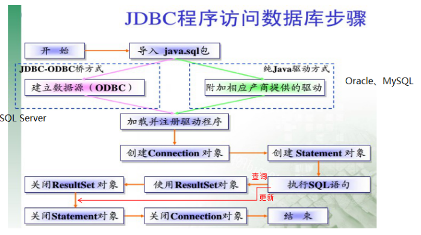

# 第一章  JDBC概述

之前我们学习了JavaSE，编写了Java程序，数据保存在变量、数组、集合等中，无法持久化，后来学习了IO流可以将数据写入文件，但不方便管理数据以及维护数据的关系；

后来我们学习了数据库管理软件MySQL，可以方便的管理数据。

那么如何将它俩结合起来呢？即Java程序<==>MySQL，实现数据的存储和处理。

那么就可以使用JDBC技术。

## 1.1 为什么需要JDBC

1. 没有JDBC


2. 有了JDBC后


## 1.2 JDBC概述

JDBC：Java Database Connectivity，它是代表一组独立于任何数据库管理系统（DBMS）的API，声明在java.sql与javax.sql包中，是SUN(现在Oracle)提供的一组接口规范。由各个数据库厂商来提供实现类，这些实现类的集合构成了数据库驱动jar。


即JDBC技术包含两个部分：

（1）java.sql包和javax.sql包中的API

> 因为为了项目代码的可移植性，可维护性，SUN公司从最初就制定了Java程序连接各种数据库的统一接口规范。这样的话，不管是连接哪一种DBMS软件，Java代码可以保持一致性。

（2）各个数据库厂商提供的jar

> 因为各个数据库厂商的DBMS软件各有不同，那么内部如何通过sql实现增、删、改、查等管理数据，只有这个数据库厂商自己更清楚，因此把接口规范的实现交给各个数据库厂商自己实现。

## 1.3 JDBC使用步骤

### 1.3.1 准备工作

```mysql
create database day04;

use day04;

create table user(
	id int primary key auto_increment,
	username varchar(20),
	password varchar(20),
	nickname varchar(20)
);

INSERT INTO `USER` VALUES(null,'zs','123456','老张');
INSERT INTO `USER` VALUES(null,'ls','123456','老李');
INSERT INTO `USER` VALUES(null,'wangwu','123','东方不败');
```

### 1.3.2 注册驱动

（1）将DBMS数据库管理软件的驱动jar拷贝到项目的libs目录中

例如：mysql-connector-java-5.1.36-bin.jar

（2）把驱动jar添加到项目的build path中

（3）将驱动类加载到内存中

```java
Class.forName("com.mysql.jdbc.Driver");
```

### 1.3.3 获取Connection连接对象

Connection conn = DriverManager.getConnection(url,username,password);

mysql的url：jdbc:mysql://localhost:3306/数据库名?参数名=参数值

jdbc:mysql://localhost:3306/testdb?useUnicode=true&characterEncoding=utf8（如果JDBC程序与服务器端的字符集不一致，会导致乱码，那么可以通过参数指定服务器端的字符集)

```java
String url = "jdbc:mysql://localhost:3306/jdbc_test?useUnicode=true&characterEncoding=utf8";
String user = "root";
String password = "123456";
//获得连接
Connection connection = DriverManager.getConnection(url, user, password);
```

### 1.3.4 执行sql并处理结果

（1）编写sql

```java
String sql = "select *from user";
```

（2）创建Statement对象

```java
Statement statement = connection.createStatement();
```

（3）使用Statement对象执行sql

增删改：调用executeUpate方法

查询：调用executeQuery方法

```java
ResultSet resultSet = statement.executeQuery(sql);
```

（4）处理结果

增删改：返回的是整数值,表示受到影响的数据条数

查询：返回ResultSet结果

* boolean next()：判断是否还有下一行

* getString(字段名或序号),getInt(字段名或序号),getObject(字段名或序号)

```java
while (resultSet.next()) {
    //获取每一列的数据
    System.out.println(resultSet.getObject(1));
    System.out.println(resultSet.getObject(2));
    System.out.println(resultSet.getObject(3));
    System.out.println(resultSet.getObject(4));
}
```

### 1.3.5 释放资源

原则是后创建的资源先关闭，我们会依次关闭ResultSet、Statement、Connection对象

```java
//关闭资源
if(resultSet != null){
    resultSet.close();

}

if(statement  != null){
    statement .close();
}

if(connection != null){
    connection.close();
}
```

## 1.4 JDBC使用小结



# 第二章 JDBC的增删改查练习

## 2.1 执行添加的SQL语句

```java
@Test
public void fun01() throws Exception {
    //增加  insert into user values(null,'tq','77777','田七');
    //1.注册驱动
    Class.forName("com.mysql.jdbc.Driver");

    //2.获得连接
    String url = "jdbc:mysql://localhost:3306/jdbc_test?useUnicode=true&characterEncoding=utf8";
    String user = "root";
    String password = "123456";
    Connection connection = DriverManager.getConnection(url, user, password);

    //3.创建执行sql语句对象
    Statement statement = connection.createStatement();

    //4.执行sql语句
    String sql = "insert into user values(null,'tq','77777','田七')";
    int rows = statement.executeUpdate(sql);
    System.out.println("几行收影响=" + rows);

    //5.释放资源
    if (statement != null) {
        statement.close();
    }
    if (connection != null) {
        connection.close();
    }

}
```

## 2.2 执行删除的SQL语句

```java
@Test
//删除id为5的用户
public void fun03() throws Exception {
    //1.注册驱动
    Class.forName("com.mysql.jdbc.Driver");

    //2.获得连接
    String url = "jdbc:mysql://localhost:3306/jdbc_test?useUnicode=true&characterEncoding=utf8";
    String user = "root";
    String password = "123456";
    Connection connection = DriverManager.getConnection(url, user, password);

    //3.创建执行sql语句对象
    Statement statement = connection.createStatement();

    //4.执行sql语句
    String sql = "delete from user where id = 5";
    statement.executeUpdate(sql);

    //5.释放资源
    if (statement != null) {
        statement.close();
    }
    if (connection != null) {
        connection.close();
    }
}
```

## 2.3 执行修改的SQL语句

```java
@Test
//更新 把id为4的用户的密码改成88888888
public void fun02() throws Exception {
    //1.注册驱动
    Class.forName("com.mysql.jdbc.Driver");

    //2.获得连接
    String url = "jdbc:mysql://localhost:3306/jdbc_test?useUnicode=true&characterEncoding=utf8";
    String user = "root";
    String password = "123456";
    Connection connection = DriverManager.getConnection(url, user, password);

    //3.创建执行sql语句对象
    Statement statement = connection.createStatement();

    //4.执行sql语句
    String sql = "update user set  password = '88888888' where id = 4";
    statement.executeUpdate(sql);

    //5.释放资源
    if (statement != null) {
        statement.close();
    }
    if (connection != null) {
        connection.close();
    }

}
```

## 2.4 执行查询单行数据的SQL语句

要求: 将查询到的结果封装到User对象中

**User类**

```java
public class User {

    private int id;
    private String username;
    private String password;
    private String nickname;

    //提供get/set方法 Alt+Insert


    public User() {
    }

    public User(int id, String username, String password, String nickname) {
        this.id = id;
        this.username = username;
        this.password = password;
        this.nickname = nickname;
    }

    public int getId() {
        return id;
    }

    public void setId(int id) {
        this.id = id;
    }

    public String getUsername() {
        return username;
    }

    public void setUsername(String username) {
        this.username = username;
    }

    public String getPassword() {
        return password;
    }

    public void setPassword(String password) {
        this.password = password;
    }

    public String getNickname() {
        return nickname;
    }

    public void setNickname(String nickname) {
        this.nickname = nickname;
    }

    @Override
    public String toString() {
        return "User{" +
            "id=" + id +
            ", username='" + username + '\'' +
            ", password='" + password + '\'' +
            ", nickname='" + nickname + '\'' +
            '}';
    }
}
```

**JDBC 代码**

```java
@Test
public void fun04() throws Exception {
    //查询id为1的用户
    //1.注册驱动
    Class.forName("com.mysql.jdbc.Driver");

    //2.获得连接
    String url = "jdbc:mysql://localhost:3306/jdbc_test?useUnicode=true&characterEncoding=utf8";
    String username = "root";
    String password = "123456";
    Connection connection = DriverManager.getConnection(url, username, password);

    //3.创建执行sql语句对象
    Statement statement = connection.createStatement();

    //4.执行sql语句
    String sql = "select * from user where id = 1";
    ResultSet resultSet = statement.executeQuery(sql);

    User user = null;
    while (resultSet.next()) {
        //每遍历一次,就是一条数据.就是一个User对象(有数据才有user)
        user = new User(resultSet.getInt("id"),
                        resultSet.getString("username"),
                        resultSet.getString("password"),
                        resultSet.getString("nickname"));
    }


    //获得用户名
    System.out.println("用户名="+user.getUsername());

    //5.释放资源
    if (resultSet != null) {
        resultSet.close();
    }

    if (statement != null) {
        statement.close();
    }
    if (connection != null) {
        connection.close();
    }
}
```

## 2.5 执行查询多行数据的SQL语句

要求: 将查询到的多行数据封装到List\<User\>中

```java
@Test
//查询所有用户
public void fun05() throws Exception {
    //1.注册驱动
    //DriverManager.registerDriver(new Driver());
    //类全限定名(带包名), 加载Driver类, 静态代码块就会执行, 驱动就注册了
    Class.forName("com.mysql.jdbc.Driver");

    //2.获得连接(连接数据库)
    //连接数据库路径
    String url="jdbc:mysql://localhost:3306/jdbc_test?useUnicode=true&characterEncoding=utf8";
    String username = "root";
    String password= "123456";
    Connection connection = DriverManager.getConnection(url, username, password);

    //3.创建执行sql语句的对象
    Statement statement = connection.createStatement();

    //4.执行sql语句, 处理结果
    String sql = "select * from user";
    ResultSet resultSet = statement.executeQuery(sql);

    List<User> list = new ArrayList<User>();

    while (resultSet.next()){
        //每遍历一次就是一条数据, 就封装成一个User对象. 把封装的每一个User添加到list集合里面
        User user = new User(resultSet.getInt("id"),
                             resultSet.getString("username"),
                             resultSet.getString("password"),
                             resultSet.getString("nickname")
                            );
        list.add(user);
    }


    //获得第二个用户的用户名
    System.out.println(list);

    //5.释放资源(先创建的后关闭)
    if(resultSet != null){
        resultSet.close();
    }

    if(statement != null){
        statement.close();
    }
    if(connection != null){
        connection.close();
    }

}
```


# 第二章  使用PreparedStatement处理CRUD

## 2.1 Statement存在的问题

### 2.1.1 每次执行一个SQL语句都需要先编译

```java
String sql1 = "insert into user values(null,'tq','77777','田七')";
String sql2 = "insert into user values(null,'zl','666666','赵六')";
String sql3 = "insert into user values(null,'zs','333333','张三')";
//如果使用Statement执行上述SQL语句需要编译三次
```

### 2.1.2 sql语句拼接

```java
String username = "ww";
String password= "555555";
String nickname = "王五";
String sql = "insert into user values(null,"+username+","+password+","+nickname+")";
```

### 2.1.3 sql注入

```java
String username = "hahahahha' or '1'='1"
String sql = "SELECT * FROM user where username='" + username + "'";
//结果会把所有数据都查询出来
Statement st = conn.createStatement();
ResultSet rs = st.executeQuery(sql);
```

## 2.2 PreparedStatement解决问题

### 2.2.1 预编译

PreparedStatement会先对参数化的SQL语句进行预编译，执行SQL语句的时候不会再进行编译

```java
String sql = "insert into user values(null,?,?,?)";
//预编译
PreparedStatement pstm = connection.prepareStatement(sql);
//后续设置参数、执行添加多少条数据都不会再重新编译
```

### 2.2.2 避免sql拼接

```java
String username = "ww";
String password= "555555";
String nickname = "王五";
String sql = "insert into user values(null,?,?,?)";
//预编译
PreparedStatement pstm = connection.prepareStatement(sql);
//设置参数
pstm.setObject(1, username);
pstm.setObject(2, password);
pstm.setObject(3, nickname);

int count = pstm.executeUpdate();//此处不能传sql
System.out.println(count);
```

### 2.2.3 防止SQL注入

PreparedStatement在进行预编译的时候，就已经确定好了SQL语句的格式，不会再因为SQL语句的拼接改变SQL语句的格式

```java
String username = "hahahahha' or '1'='1"
String sql = "SELECT * FROM user where username=?";
//即使输入'张三' or '1'= '1'也没问题
PreparedStatement pst = conn.prepareStatement(sql);

//中间加入设置？的值
pst.setObject(1, username);

ResultSet rs = pst.executeQuery();
```

## 2.3 获取自增长键值

### 2.3.1 获取自增长键值的应用场景

主要使用在一些复杂的业务中，在添加完主表的一条数据之后，要获取到这条数据的主键值，然后将该值添加进从表的外键字段

### 2.3.2 获取自增长键值的步骤

1. 在预编译的时候，指定要返回自增长的key

   ```java
   PreparedStatement pst = conn.prepareStatement(sql,Statement.RETURN_GENERATED_KEYS);
   ```

2. 在执行完添加数据的SQL语句之后，通过PreparedStatement的对象调用getGeneratedKeys()方法来获取自增长键值，遍历结果集

   ```java
   ResultSet rs = pst.getGeneratedKeys();
   ```

3. 遍历获取自增长的键值

   ```java
   if(rs.next()){
       Object key = rs.getObject(1);
       System.out.println("自增的key值did =" + key);
   }
   ```

**示例代码**

```java
public class TestAutoIncrement {
	public static void main(String[] args) throws Exception{
		//1、注册驱动
		Class.forName("com.mysql.jdbc.Driver");
		
		//2、获取连接
		Connection conn = DriverManager.getConnection("jdbc:mysql://localhost:3306/jdbc_test?useUnicode=true&characterEncoding=utf8", "root", "123456");
		
		//3、执行sql
		String sql = "insert into user values(null,?,?,?)";
		/*
		 * 这里在创建PreparedStatement对象时，传入第二个参数的作用，就是告知服务器端
		 * 当执行完sql后，把自增的key值返回来。
		 */
		PreparedStatement pst = conn.prepareStatement(sql,Statement.RETURN_GENERATED_KEYS);
		
		//设置？的值
		pst.setObject(1, "aobama");
		pst.setObject(2, "12345678");
		pst.setObject(3, "圣枪游侠");
		//执行sql
		int len = pst.executeUpdate();//返回影响的记录数
		if(len>0){
			//从pst中获取到服务器端返回的键值
			ResultSet rs = pst.getGeneratedKeys();
			//因为这里的key值可能多个，因为insert语句可以同时添加多行，所以用ResultSet封装
			//这里因为只添加一条，所以用if判断
			if(rs.next()){
				Object key = rs.getObject(1);
				System.out.println("自增的key值did =" + key);
			}
		}
			
		//4、关闭
		pst.close();
		conn.close();
	}
}
```

## 2.4 批处理

### 2.4.1 批处理优势和应用场景
批处理相比较单独一条条执行SQL语句来说，其效率高很多。批处理一般会使用在批量添加多条数据和批量修改多条数据
### 2.4.2 批处理的具体操作步骤

1. 在url中要加一个参数 `rewriteBatchedStatements=true`,那么此时url就变成了

   ```java
   jdbc:mysql://localhost:3306/jdbc_test?useUnicode=true&characterEncoding=utf8&rewriteBatchedStatements=true
   ```

2. 在完成所有参数设置之后，调用PreparedStatement的addBatch()方法，添加到批处理中
3. 最后执行PreparedStatement的executeBatch()方法执行批处理语句

```java
public class TestBatch {
	
	public static void main(String[] args) throws Exception{
		long start = System.currentTimeMillis();
		//例如：在部门表t_department中添加1000条模拟数据
		//1、注册驱动
		Class.forName("com.mysql.jdbc.Driver");
		
		//2、获取连接
		Connection conn = DriverManager.getConnection("jdbc:mysql://localhost:3306/jdbc_test?useUnicode=true&characterEncoding=utf8&rewriteBatchedStatements=true", "root", "123456");
		
		//3、执行sql，sql语句不能用value，只能用values
		String sql = "insert into user values(null,?,?,?)";
		PreparedStatement pst = conn.prepareStatement(sql);
		
		//设置？的值
		for (int i = 1; i <=1000; i++) {
			pst.setObject(1, "aobama"+i);
			pst.setObject(2, "000000"+i);
			pst.setObject(3, "圣枪游侠"+i);
			pst.addBatch();//添加到批处理一组操作中，攒一块处理
		}
		pst.executeBatch();
		
		//4、关闭
		pst.close();
		conn.close();
		
		long end = System.currentTimeMillis();
		System.out.println("耗时：" + (end - start));//耗时：821
	}
}
```

## 2.5 事务

### 2.5.1 事务操作的步骤

1. 执行逻辑单元之前先开启事务
2. 逻辑单元执行完毕，没有出现异常则提交事务
3. 逻辑单元执行过程中出现异常，则回滚事务

### 2.5.2 事务相关API

| Connection中与事务有关的方法      | **说明**                                                     |
| --------------------------------- | ------------------------------------------------------------ |
| setAutoCommit(boolean autoCommit) | 参数是true或false  如果设置为false，表示关闭自动提交，相当于开启事务; 类似sql里面的 start transaction; |
| void commit()                     | 提交事务; 类似sql里面的 commit;                              |
| void rollback()                   | 回滚事务; 类似sql里面的 rollback;                            |

### 2.5.3 使用JDBC的事务完成转账案例

#### 2.5.3.1 准备数据

```mysql
create table account(
    id int primary key auto_increment,
    name varchar(20),
    money double
);

insert into account values (null,'zs',1000);
insert into account values (null,'ls',1000);
insert into account values (null,'ww',1000);
```

#### 2.5.3.2 代码实现

```java
package com.atguigu.jdbc;

import org.junit.Test;

import java.sql.Connection;
import java.sql.DriverManager;
import java.sql.PreparedStatement;

/**
 * 包名:com.atguigu.jdbc
 *
 * @author Leevi
 * 日期2021-04-29  11:40
 * 事务相关的API:
 * 1. 开启事务 connection.setAutoCommit(false);
 * 2. 提交事务 connection.commit();
 * 3. 回滚事务 connection.rollback();
 * 4. 事务结束之后，要将此此接的autoCommit还原成true
 */
public class TestTransaction {
    @Test
    public void testTransfer() throws Exception {
        //测试转账
        //1. 注册驱动
        Class.forName("com.mysql.jdbc.Driver");
        //2. 获得连接
        Connection conn = DriverManager.getConnection("jdbc:mysql:///day04?characterEncoding=utf8","root","123456");
        //3. 预编译sql语句
        String sql = "update account set money=money+? where name=?";//改变用户的金额
        PreparedStatement preparedStatement = conn.prepareStatement(sql);

        //开启事务
        conn.setAutoCommit(false);
        try {
            //3.1 zs扣款500
            preparedStatement.setObject(1,-500);
            preparedStatement.setObject(2,"zs");
            //执行zs扣款的sql语句
            preparedStatement.executeUpdate();

            int num = 10/0;

            //3.2 ls收款500
            preparedStatement.setObject(1,500);
            preparedStatement.setObject(2,"ls");
            preparedStatement.executeUpdate();

            //提交事务
            conn.commit();
        } catch (Exception e) {
            e.printStackTrace();
            conn.rollback();
        }finally {
            //还原connection的AutoCommit为true
            conn.setAutoCommit(true);
        }
        //关闭资源
        preparedStatement.close();
        conn.close();
    }
}
```

# 第三章  数据库连接池

## 3.1 什么是数据库连池

连接池是connection对象的缓冲区，它里面会存放一些connection，当我们Java程序需要使用connection的时候，如果连接池中有则直接从连接池获取，不需要去新创建connection了。连接池让Java程序能够复用连接、管理连接

## 3.2 为什么要使用连接池

* 1.因为每次创建和销毁连接都会带来较大的系统开销
* 2.每次创建和销毁连接都要消耗大概0.05~1s的时间。
* 3.可以防止大量用户并发访问数据库服务器。

## 3.3 连接池的优势

1.  资源重用

由于数据库连接得到重用，避免了频繁创建、释放连接引起的大量性能开销。在减少系统消耗的基础上，另一方面也增进了系统运行环境的平稳性（减少内存碎片以及数据库临时进程/线程的数量）。

2. 更快的系统响应速度

数据库连接池在初始化过程中，往往已经创建了若干数据库连接置于池中备用。此时连接的初始化工作均已完成。对于业务请求处理而言，直接利用现有可用连接，避免了数据库连接初始化和释放过程的时间开销，从而缩减了系统整体响应时间。

3. 新的资源分配手段

对于多应用共享同一数据库的系统而言，可在应用层通过数据库连接的配置，实现数据库连接池技术，几年前也许还是个新鲜话题，对于目前的业务系统而言，如果设计中还没有考虑到连接池的应用，那么…….快在设计文档中加上这部分的内容吧。某一应用最大可用数据库连接数的限制，避免某一应用独占所有数据库资源。

4. 统一的连接管理，避免数据库连接泄漏

在较为完备的数据库连接池实现中，可根据预先的连接占用超时设定，强制收回被占用连接。从而避免了常规数据库连接操作中可能出现的资源泄漏。

## 3.5 连接池的原理
1. 连接池维护着两个容器**空闲池**和**活动池**
2. 空闲池用于存放未使用的连接，活动池用于存放正在使用的连接，活动池中的连接使用完之后要归还回空闲池
3. 当Java程序需要连接时，先判断空闲池中是否有连接，如果空闲池中有连接则取出一个连接放置到活动池供Java程序使用
4. Java程序需要连接时，如果空闲池中没有连接了，则先判断活动池的连接数是否已经达到了最大连接数，如果未达到最大连接数，则会新创建一个连接放置到活动池，供Java程序使用
5. 如果空闲池中没有连接了，活动池中的连接也已经达到了最大连接数，则不能新创建连接了，那么此时会判断是否等待超时，如果没有等待超时则需要等待活动池中的连接归还回空闲池
6. 如果等待超时了，则可以采取多种处理方式，例如:直接抛出超时异常，或者将活动池中使用最久的连接移除掉归还回空闲池以供Java程序使用

## 3.6 连接池的实现

### 3.6.1 DataSource接口

JDBC 的数据库连接池使用 javax.sql.DataSource 来表示，DataSource 只是一个接口（通常被称为数据源），所有的Java数据库连接池都需要实现该接口。该接口通常由服务器(Weblogic, WebSphere, Tomcat)提供实现，也有一些开源组织提供实现

### 3.6.2 常见的数据库连接池

* **DBCP** 是Apache提供的数据库连接池，**速度相对c3p0较快**，但因自身存在BUG，Hibernate3已不再提供支持
* **C3P0** 是一个开源组织提供的一个数据库连接池，**速度相对较慢，稳定性还可以**
* **Proxool** 是sourceforge下的一个开源项目数据库连接池，有监控连接池状态的功能，**稳定性较c3p0差一点**
* **HikariCP** 俗称**光连接池**,是目前速度最快的连接池
* **Druid** 是阿里提供的数据库连接池，据说是集DBCP 、C3P0 、Proxool 优点于一身的数据库连接池

### 3.6.3 Druid连接池的使用

（1）加入jar包

例如：druid-1.1.10.jar

（2）代码步骤

第一步：创建druid连接池的配置文件druid.properties文件，放置到类路径下

```properties
driverClassName=com.mysql.jdbc.Driver
url=jdbc:mysql://localhost:3306/test
username=root
password=123456
initialSize=5
maxActive=10
maxWait=1000
```

第二步：使用工厂模式创建DruidDataSource对象

```java
//1. 创建一个Properties对象，让其去读取druid.properties文件
Properties properties = new Properties();
//1.1 将druid.properties配置文件转成字节输入流
//FileInputStream is = new FileInputStream("D:\\讲课资料\\尚硅谷\\210323JavaEE（深圳）\\atguigu0323\\day04_JDBC_01\\resources\\druid.properties");

//使用相对路径来将配置文件转成字节输入流,我们可以使用类加载器来读取类路径下文件
//TestDataSource.class.getClassLoader() 表示获取ClassLoader对象
InputStream is = TestDataSource.class.getClassLoader().getResourceAsStream("druid.properties");

//1.2 使用properties对象加载流
properties.load(is);

//2. 使用DruidDataSourceFactory创建Druid连接池对象
DataSource dataSource = DruidDataSourceFactory.createDataSource(properties);
```

第三步：使用连接池对象获取连接

```java
Connection connection = dataSource.getConnection();
```


### 3.6.4 Druid连接池的配置参数列表

| **配置**                      | **缺省** | **说明**                                                     |
| ----------------------------- | -------- | ------------------------------------------------------------ |
| name                          |          | 配置这个属性的意义在于，如果存在多个数据源，监控的时候可以通过名字来区分开来。 如果没有配置，将会生成一个名字，格式是：”DataSource-” + System.identityHashCode(this) |
| url                           |          | 连接数据库的url，不同数据库不一样。例如：mysql : jdbc:mysql://10.20.153.104:3306/druid2 oracle : jdbc:oracle:thin:@10.20.149.85:1521:ocnauto |
| username                      |          | 连接数据库的用户名                                           |
| password                      |          | 连接数据库的密码。如果你不希望密码直接写在配置文件中，可以使用ConfigFilter。详细看这里：<https://github.com/alibaba/druid/wiki/%E4%BD%BF%E7%94%A8ConfigFilter> |
| driverClassName               |          | 根据url自动识别 这一项可配可不配，如果不配置druid会根据url自动识别dbType，然后选择相应的driverClassName(建议配置下) |
| initialSize                   | 0        | 初始化时建立物理连接的个数。初始化发生在显示调用init方法，或者第一次getConnection时 |
| maxActive                     | 8        | 最大连接池数量                                               |
| maxIdle                       | 8        | 已经不再使用，配置了也没效果                                 |
| minIdle                       |          | 最小连接池数量                                               |
| maxWait                       |          | 获取连接时最大等待时间，单位毫秒。配置了maxWait之后，缺省启用公平锁，并发效率会有所下降，如果需要可以通过配置useUnfairLock属性为true使用非公平锁。 |
| poolPreparedStatements        | false    | 是否缓存preparedStatement，也就是PSCache。PSCache对支持游标的数据库性能提升巨大，比如说oracle。在mysql下建议关闭。 |
| maxOpenPreparedStatements     | -1       | 要启用PSCache，必须配置大于0，当大于0时，poolPreparedStatements自动触发修改为true。在Druid中，不会存在Oracle下PSCache占用内存过多的问题，可以把这个数值配置大一些，比如说100 |
| validationQuery               |          | 用来检测连接是否有效的sql，要求是一个查询语句。如果validationQuery为null，testOnBorrow、testOnReturn、testWhileIdle都不会其作用。 |
| testOnBorrow                  | true     | 申请连接时执行validationQuery检测连接是否有效，做了这个配置会降低性能。 |
| testOnReturn                  | false    | 归还连接时执行validationQuery检测连接是否有效，做了这个配置会降低性能 |
| testWhileIdle                 | false    | 建议配置为true，不影响性能，并且保证安全性。申请连接的时候检测，如果空闲时间大于timeBetweenEvictionRunsMillis，执行validationQuery检测连接是否有效。 |
| timeBetweenEvictionRunsMillis |          | 有两个含义： 1)Destroy线程会检测连接的间隔时间2)testWhileIdle的判断依据，详细看testWhileIdle属性的说明 |
| numTestsPerEvictionRun        |          | 不再使用，一个DruidDataSource只支持一个EvictionRun           |
| minEvictableIdleTimeMillis    |          |                                                              |
| connectionInitSqls            |          | 物理连接初始化的时候执行的sql                                |
| exceptionSorter               |          | 根据dbType自动识别 当数据库抛出一些不可恢复的异常时，抛弃连接 |
| filters                       |          | 属性类型是字符串，通过别名的方式配置扩展插件，常用的插件有： 监控统计用的filter:stat日志用的filter:log4j防御sql注入的filter:wall |
| proxyFilters                  |          | 类型是List，如果同时配置了filters和proxyFilters，是组合关系，并非替换关系 |

# 第四章  封装JDBCTools

配置文件：src/jdbc.properties  或者resources/jdbc.properties

```properties
driverClassName=com.mysql.jdbc.Driver
url=jdbc:mysql://localhost:3306/jdbc_test
username=root
password=123456
initialSize=5
maxActive=10
maxWait=1000
```

JDBCTools工具类：

```java
package com.atguigu.jdbc.utils;

import com.alibaba.druid.pool.DruidDataSourceFactory;

import javax.sql.DataSource;
import java.io.InputStream;
import java.sql.Connection;
import java.sql.SQLException;
import java.util.Properties;

/**
 * 包名:com.atguigu.jdbc.utils
 *
 * @author Leevi
 * 日期2021-04-29  15:15
 * 这个工具类中会提供仨方法:
 * 1. 获取连接池对象
 * 2. 从连接池中获取连接
 * 3. 将链接归还到连接池
 */
public class JDBCTools {
    private static DataSource dataSource;
    static {
        try {
            //1. 使用类加载器读取配置文件，转成字节输入流
            InputStream is = JDBCTools.class.getClassLoader().getResourceAsStream("druid.properties");
            //2. 使用Properties对象加载字节输入流
            Properties properties = new Properties();
            properties.load(is);
            //3. 使用DruidDataSourceFactory创建连接池对象
            dataSource = DruidDataSourceFactory.createDataSource(properties);
        } catch (Exception e) {
            e.printStackTrace();
        }
    }

    /**
     * 获取连接池对象
     * @return
     */
    public static DataSource getDataSource(){

        return dataSource;
    }

    /**
     * 获取连接
     * @return
     */
    public static Connection getConnection() {
        try {
            return dataSource.getConnection();
        } catch (SQLException e) {
            e.printStackTrace();
            throw new RuntimeException(e.getMessage());
        }
    }

    public static void releaseConnection(Connection connection){
        try {
            connection.close();
        } catch (SQLException e) {
            e.printStackTrace();
            throw new RuntimeException(e.getMessage());
        }
    }
}
```

## 连接池使用的总结

1. 拷贝加入druid的jar包
2. 拷贝druid的配置文件到类路径,并修改
3. 拷贝JDBCTools工具类
4. 在需要连接的地方编写`Connection conn = JDBCTools.getConnection();`此时拿到的连接就是从连接池拿的
   1. 连接使用完毕之后，调用`JDBCTools.releaseConnection(conn);`归还连接

# 第五章 Apache的DBUtils

## 5.1 DBUtils的概述

commons-dbutils 是 Apache 组织提供的一个开源 JDBC工具类库，它是对JDBC的简单封装，学习成本极低，并且使用dbutils能极大简化jdbc编码的工作量，同时也不会影响程序的性能。

其中QueryRunner类封装了SQL的执行，是线程安全的。

（1）可以实现增、删、改、查、批处理、

（2）考虑了事务处理需要共用Connection。

（3）该类最主要的就是简单化了SQL查询，它与ResultSetHandler组合在一起使用可以完成大部分的数据库操作，能够大大减少编码量。

## 5.2 DBUtils执行增删改的SQL语句

### 5.2.1 API介绍

1. QueryRunner() ,创建QueryRunner对象，用于执行SQL语句
2. QueryRunner的update(Connection conn, String sql, Object... params)方法，用于执行增删改的SQL语句

### 5.2.2 代码实现

```java
//向user表添加一条数据
public void  testInsert() throws SQLException{
    //创建queryRunner对象
    QueryRunner queryRunner = new QueryRunner();

    //String sql = "insert into user values(null,'aaa','111','露西')";
    String sql = "insert into user values(?,?,?,?)";

    Object[] params ={null,"aaa","111","露西"};
    queryRunner.update(JDBCTools.getConnection(),sql, params);
}
//把用户名是aaa的user密码改成222

public  void testUpdate() throws SQLException{
    //创建queryRunner对象
    QueryRunner queryRunner = new QueryRunner();

    String sql = "update user set password = ? where username = ?";
    Object[] params={"222","aaa"};
    queryRunner.update(JDBCTools.getConnection(),sql, params);

}
//把用户名是aaa的user给删除

public  void testDelete() throws SQLException{
    //创建queryRunner对象
    QueryRunner queryRunner = new QueryRunner();

    String sql = "delete from user where username = ?";
    Object[] params={"aaa"};
    queryRunner.update(JDBCTools.getConnection(),sql, params);

}
```

## 5.2.3 DBUtils执行批处理

### 5.2.3.1 API介绍

1. `public int[] batch(Connection conn,String sql,Object[][] params)throws SQLException`： 支持批处理INSERT, UPDATE, or DELETE语句
2. `public <T> T insertBatch(Connection conn,String sql,ResultSetHandler<T> rsh,Object[][] params)throws SQLException`：只支持INSERT语句

### 5.2.3.2 代码实现

```java
public static void main(String[] args) throws Exception {
    long start = System.currentTimeMillis();
    //例如：在部门表t_department中添加20条模拟数据
    QueryRunner queryRunner = new QueryRunner();

    Object[][] params = new Object[20][3];

    //3、执行sql，sql语句不能用value，只能用values
    String sql = "insert into user values(null,?,?,?)";

    //设置？的值
    for (int i = 0; i <20; i++) {
        Object[] insertParams = new Object[3];
        insertParams[0] = "aobama"+i;
        insertParams[1] = "000000"+i;
        insertParams[2] = "圣枪游侠"+i;
        params[i] = insertParams;
    }

    queryRunner.batch(JDBCUtil.getConnection(),sql,params);

    long end = System.currentTimeMillis();
    System.out.println("耗时：" + (end - start));//耗时：821
}
```

## 5.2.4 使用QueryRunner类实现查询

### 5.2.3 API介绍

1. query(String sql, ResultSetHandler<T> rsh, Object... params) ，执行查询 select
2. ResultSetHandler结果集处理类

##### 

| Handler类型         | 说明                                                         |
| ------------------- | ------------------------------------------------------------ |
| ArrayHandler        | 将结果集中的第一条记录封装到一个Object[]数组中，数组中的每一个元素就是这条记录中的每一个字段的值 |
| ArrayListHandler    | 将结果集中的每一条记录都封装到一个Object[]数组中，将这些数组在封装到List集合中。 |
| **BeanHandler**     | 将结果集中第一条记录封装到一个指定的javaBean中。             |
| **BeanListHandler** | 将结果集中每一条记录封装到指定的javaBean中，将这些javaBean在封装到List集合中 |
| ColumnListHandler   | 将结果集中指定的列的字段值，封装到一个List集合中             |
| KeyedHandler        | 将结果集中每一条记录封装到Map<String,Object>,在将这个map集合做为另一个Map的value,另一个Map集合的key是指定的字段的值。 |
| MapHandler          | 将结果集中第一条记录封装到了Map<String,Object>集合中，key就是字段名称，value就是字段值 |
| MapListHandler      | 将结果集中每一条记录封装到了Map<String,Object>集合中，key就是字段名称，value就是字段值，在将这些Map封装到List集合中。 |
| **ScalarHandler**   | 它是用于单个数据。例如select  count(*) from 表。             |

### 5.2.4 代码实现

```java
//查询id为1的用户信息

@Test
public  void selectById() throws SQLException{
    //创建queryRunner对象
    QueryRunner queryRunner = new QueryRunner();
    String sql = "select *from user where id = ?";
    Object[] params = {1};

    User user = queryRunner.query(JDBCTools.getConnection(),sql, new BeanHandler<>(User.class), params);

    System.out.println(user.toString());

}

//查询所有的用户信息
@Test
public  void selectAll() throws SQLException{
    //创建queryRunner对象
    QueryRunner queryRunner = new QueryRunner();

    String sql = "select *from user";
    Object[] params = {};

    List<User> list = queryRunner.query(JDBCTools.getConnection(),sql, new BeanListHandler<>(User.class), params);

    System.out.println(list.toString());

}
//统计用户的个数

@Test
public  void getCount() throws SQLException{
    //创建queryRunner对象
    QueryRunner queryRunner = new QueryRunner();

    String sql = "select count(*) from user";

    Long n = (Long) queryRunner.query(JDBCTools.getConnection(),sql, new ScalarHandler());

    System.out.println(n.intValue());
}
```

# 经典错误

## 1、jar包版本不兼容

```
Exception in thread "main" com.mysql.jdbc.exceptions.jdbc4.MySQLNonTransientConnectionException: Could not create connection to database server.
	at sun.reflect.NativeConstructorAccessorImpl.newInstance0(Native Method)
	at sun.reflect.NativeConstructorAccessorImpl.newInstance(NativeConstructorAccessorImpl.java:62)
	at sun.reflect.DelegatingConstructorAccessorImpl.newInstance(DelegatingConstructorAccessorImpl.java:45)
	at java.lang.reflect.Constructor.newInstance(Constructor.java:423)
	at com.mysql.jdbc.Util.handleNewInstance(Util.java:408)
	at com.mysql.jdbc.Util.getInstance(Util.java:383)
	at com.mysql.jdbc.SQLError.createSQLException(SQLError.java:1023)
	at com.mysql.jdbc.SQLError.createSQLException(SQLError.java:997)
	at com.mysql.jdbc.SQLError.createSQLException(SQLError.java:983)
	at com.mysql.jdbc.SQLError.createSQLException(SQLError.java:928)
	at com.mysql.jdbc.ConnectionImpl.connectOneTryOnly(ConnectionImpl.java:2576)
	at com.mysql.jdbc.ConnectionImpl.createNewIO(ConnectionImpl.java:2309)
	at com.mysql.jdbc.ConnectionImpl.<init>(ConnectionImpl.java:834)
	at com.mysql.jdbc.JDBC4Connection.<init>(JDBC4Connection.java:46)
	at sun.reflect.NativeConstructorAccessorImpl.newInstance0(Native Method)
	at sun.reflect.NativeConstructorAccessorImpl.newInstance(NativeConstructorAccessorImpl.java:62)
	at sun.reflect.DelegatingConstructorAccessorImpl.newInstance(DelegatingConstructorAccessorImpl.java:45)
	at java.lang.reflect.Constructor.newInstance(Constructor.java:423)
	at com.mysql.jdbc.Util.handleNewInstance(Util.java:408)
	at com.mysql.jdbc.ConnectionImpl.getInstance(ConnectionImpl.java:419)
	at com.mysql.jdbc.NonRegisteringDriver.connect(Loading class `com.mysql.jdbc.Driver'. This is deprecated. The new driver class is `com.mysql.cj.jdbc.Driver'. The driver is automatically registered via the SPI and manual loading of the driver class is generally unnecessary.
Exception in thread "main" java.sql.SQLException: The server time zone value '�й���׼ʱ��' is unrecognized or represents more than one time zone. You must configure either the server or JDBC driver (via the serverTimezone configuration property) to use a more specifc time zone value if you want to utilize time zone support.
	at com.mysql.cj.jdbc.exceptions.SQLError.createSQLException(SQLError.java:129)
	at com.mysql.cj.jdbc.exceptions.SQLError.createSQLException(SQLError.java:97)
	at com.mysql.cj.jdbc.exceptions.SQLError.createSQLException(SQLError.java:89)
	at com.mysql.cj.jdbc.exceptions.SQLError.createSQLException(SQLError.java:63)
	at com.mysql.cj.jdbc.exceptions.SQLError.createSQLException(SQLError.java:73)
	at com.mysql.cj.jdbc.exceptions.SQLExceptionsMapping.translateException(SQLExceptionsMapping.java:76)
	at com.mysql.cj.jdbc.ConnectionImpl.createNewIO(ConnectionImpl.java:835)
	at com.mysql.cj.jdbc.ConnectionImpl.<init>(ConnectionImpl.java:455)
	at com.mysql.cj.jdbc.ConnectionImpl.getInstance(ConnectionImpl.java:240)
	at com.mysql.cj.jdbc.NonRegisteringDriver.connect(NonRegisteringDriver.java:199)
	at java.sql.DriverManager.getConnection(DriverManager.java:664)
	at java.sql.DriverManager.getConnection(DriverManager.java:247)
.java:344)
	at java.sql.DriverManager.getConnection(DriverManager.java:664)
	at java.sql.DriverManager.getConnection(DriverManager.java:247)
```

看异常好像是无事务连接异常，无法创建连接。将MySQL驱动改为了最新的8.0版本的MySQL驱动。显示那个驱动类已经过时了，新的驱动类是“com.mysql.cj.jdbc.Driver”，而不是“com.mysql.jdbc.Driver”了，并且还说我没有配置时区，查了一下，原来从JDBC6.0开始驱动类使用了新的，并且url中必须要设置时区，否侧会报错。

```
第一步：使用最新的MySQL驱动jar包。
第二步：把驱动的类名改为:
static String driver="com.mysql.cj.jdbc.Driver";
第三步：在访问mysql的url后加入时区设置：
static String url="jdbc:mysql://localhost:3306/test?useUnicode=true&characterEncoding=UTF8&serverTimezone=UTC"
```

